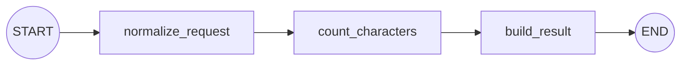

# 第 1 课：StateGraph 与普通节点

## 1.1 基本结构

一张最简单的图：



完整示例：

```python
from typing_extensions import NotRequired, TypedDict
from langgraph.graph import END, START, StateGraph


class RouteState(TypedDict):
    request: str
    normalized_request: NotRequired[str]
    char_count: NotRequired[int]
    result: NotRequired[str]


def normalize_request(state: RouteState) -> dict[str, str]:
    normalized = " ".join(state["request"].split())
    return {"normalized_request": normalized}


def count_characters(state: RouteState) -> dict[str, int]:
    return {
        "char_count": len(state["normalized_request"])
    }


def build_result(state: RouteState) -> dict[str, str]:
    return {
        "result": (
            f"已接收：{state['normalized_request']}，"
            f"共 {state['char_count']} 个字符"
        )
    }


builder = StateGraph(RouteState)

builder.add_node("normalize_request", normalize_request)
builder.add_node("count_characters", count_characters)
builder.add_node("build_result", build_result)

builder.add_edge(START, "normalize_request")
builder.add_edge("normalize_request", "count_characters")
builder.add_edge("count_characters", "build_result")
builder.add_edge("build_result", END)

graph = builder.compile()

result = graph.invoke({
    "request": "  帮我规划广州   两日游  "
})

print(result)
```

## 1.2 State

`TypedDict` 只描述 State 的结构，并不创建真正的字典：

```python
class UserState(TypedDict):
    name: str
    age: int
```

真正的初始 State 是调用时传入的：

```python
graph.invoke({
    "request": "帮我规划广州两日游"
})
```

`NotRequired` 表示字段属于 State，但初始输入中可以不存在：

```python
normalized_request: NotRequired[str]
```

它会由后续节点生成。

## 1.3 Node

节点本质上是普通函数：

```python
def node(state: State) -> dict:
    return {"field": new_value}
```

节点签名可以记成：

```text
State -> PartialState
```

节点只返回本次修改的字段，不需要返回完整 State：

```python
return {
    "char_count": 10
}
```

LangGraph 会把这个局部更新合并进现有 State。

## 1.4 Edge

固定边表示无条件跳转：

```python
builder.add_edge("node_a", "node_b")
```

`START` 和 `END` 是虚拟节点：

```python
builder.add_edge(START, "first_node")
builder.add_edge("last_node", END)
```

## 1.5 compile 与 invoke

`StateGraph` 是构建器，不能直接执行：

```python
builder = StateGraph(State)
```

必须先编译：

```python
graph = builder.compile()
```

然后才能使用：

```python
graph.invoke(...)
graph.ainvoke(...)
graph.stream(...)
graph.astream(...)
```

## 1.6 状态变化过程

```text
初始：
{"request": "  广州   两日游  "}

normalize_request：
{"normalized_request": "广州 两日游"}

count_characters：
{"char_count": 6}

build_result：
{"result": "已接收：广州 两日游，共 6 个字符"}
```

节点返回的是“本次更新”，最终 `invoke()` 返回完整 State。

## 1.7 常见错误

- 节点忘记返回字典；
- 节点读取了尚未生成的字段；
- 注册了节点却没有边通向它；
- `add_node()` 传入了 `function()`，而不是函数对象 `function`；
- 直接修改 State 并返回完整 State，导致逻辑难以追踪；
- 忘记调用 `compile()`。

---

---

[[00-课程总览|课程总览]] · [[02-Conditional-Edge条件分支|下一课]]
