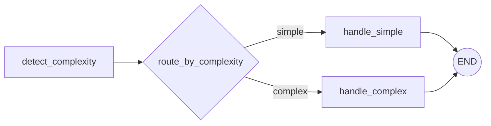

# 第 2 课：Conditional Edge 条件分支

固定边只能走一条确定路线，条件边会根据 State 决定下一步：



## 2.1 完整示例

```python
from typing import Literal
from typing_extensions import NotRequired, TypedDict
from langgraph.graph import END, START, StateGraph


class State(TypedDict):
    request: str
    complexity: NotRequired[str]
    result: NotRequired[str]


def detect_complexity(state: State) -> dict[str, str]:
    text = state["request"].strip()
    complexity = "simple" if len(text) <= 10 else "complex"

    return {"complexity": complexity}


def route_by_complexity(
    state: State,
) -> Literal["simple", "complex"]:
    return state["complexity"]


def handle_simple(state: State) -> dict[str, str]:
    return {"result": "直接处理简单请求"}


def handle_complex(state: State) -> dict[str, str]:
    return {"result": "先拆分复杂请求，再逐步执行"}


builder = StateGraph(State)

builder.add_node("detect_complexity", detect_complexity)
builder.add_node("handle_simple", handle_simple)
builder.add_node("handle_complex", handle_complex)

builder.add_edge(START, "detect_complexity")

builder.add_conditional_edges(
    "detect_complexity",
    route_by_complexity,
    {
        "simple": "handle_simple",
        "complex": "handle_complex",
    },
)

builder.add_edge("handle_simple", END)
builder.add_edge("handle_complex", END)

graph = builder.compile()
```

## 2.2 路由函数与普通节点的区别

普通节点返回字典，表示更新 State：

```python
return {
    "complexity": "simple"
}
```

路由函数返回标识符或节点名称，表示选择下一步：

```python
return "simple"
```

映射表负责把业务标识映射到节点：

```python
{
    "simple": "handle_simple",
    "complex": "handle_complex",
}
```

## 2.3 是否必须单独保存判断结果

需要保留结果时：

```text
detect_complexity 写入 State
route_by_complexity 读取并跳转
```

只需要控制流程时，可以直接判断：

```python
def route_by_length(
    state: State,
) -> Literal["handle_simple", "handle_complex"]:
    if len(state["request"]) <= 10:
        return "handle_simple"

    return "handle_complex"
```

## 2.4 Literal

```python
Literal["simple", "complex"]
```

表示函数预期只返回这些值，有利于：

- IDE 类型提示；
- 静态类型检查；
- 图的可视化；
- 阅读代码时理解可能路径。

## 2.5 直接结束

路由函数可以返回 `END`：

```python
from langgraph.graph import END

def route(state):
    if not state["request"].strip():
        return END

    return "process"
```

---

---

[[01-StateGraph与普通节点|上一课]] · [[03-Reducer与MessagesState|下一课]]
