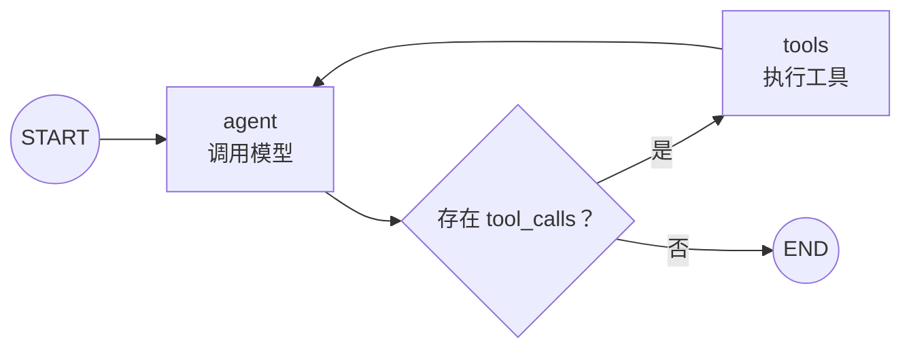

# 第 5 课：Tool Calling 与 ReAct 循环

工具调用 Agent 的核心循环：



## 5.1 完整示例

```python
import os
from dotenv import load_dotenv
from langchain_core.messages import SystemMessage
from langchain_core.tools import tool
from langchain_openai import ChatOpenAI
from langgraph.graph import MessagesState, START, StateGraph
from langgraph.prebuilt import ToolNode, tools_condition

load_dotenv()


@tool
def add(a: int, b: int) -> int:
    """计算两个整数之和。"""
    return a + b


@tool
def multiply(a: int, b: int) -> int:
    """计算两个整数之积。"""
    return a * b


tools = [add, multiply]

model = ChatOpenAI(
    model=os.environ["MODEL_NAME"],
    api_key=os.environ["OPENAI_API_KEY"],
    base_url=os.getenv("OPENAI_BASE_URL"),
    temperature=0,
)

model_with_tools = model.bind_tools(tools)


def call_model(state: MessagesState):
    response = model_with_tools.invoke([
        SystemMessage(
            content=(
                "你是计算助手。"
                "数学计算必须使用提供的工具。"
            )
        ),
        *state["messages"],
    ])

    return {
        "messages": [response]
    }


builder = StateGraph(MessagesState)

builder.add_node("agent", call_model)
builder.add_node("tools", ToolNode(tools))

builder.add_edge(START, "agent")
builder.add_conditional_edges("agent", tools_condition)
builder.add_edge("tools", "agent")

graph = builder.compile()
```

调用：

```python
result = graph.invoke({
    "messages": [
        {
            "role": "user",
            "content": "先计算 12 加 8，再把结果乘以 3。",
        }
    ]
})

print(result["messages"][-1].content)
```

## 5.2 `@tool`

`@tool` 把普通函数转换成模型可识别的工具：

```python
@tool
def add(a: int, b: int) -> int:
    """计算两个整数之和。"""
    return a + b
```

模型主要看到：

- 工具名称；
- 文档字符串；
- 参数名称；
- 参数类型；
- 参数 Schema。

因此工具描述必须明确说明能力和使用场景。

## 5.3 `bind_tools()`

```python
model_with_tools = model.bind_tools(tools)
```

它只把工具 Schema 提供给模型，不执行工具。

模型可能返回：

```python
AIMessage(
    content="",
    tool_calls=[
        {
            "name": "add",
            "args": {"a": 12, "b": 8},
            "id": "call_001",
            "type": "tool_call",
        }
    ],
)
```

一条 `AIMessage` 可以没有文本，只有工具调用请求。

## 5.4 ToolNode

```python
ToolNode(tools)
```

负责：

1. 读取最后一条 `AIMessage.tool_calls`；
2. 根据名称找到工具；
3. 解析参数；
4. 执行函数；
5. 生成 `ToolMessage`；
6. 把工具结果写回消息历史。

## 5.5 tool_call_id

```text
AIMessage 的工具请求：call_001
ToolMessage 的执行结果：call_001
```

`tool_call_id` 用于把每个工具结果和对应请求关联起来。

## 5.6 tools_condition

`tools_condition` 大致相当于：

```python
def route_tools(state: MessagesState):
    last_message = state["messages"][-1]

    if last_message.tool_calls:
        return "tools"

    return END
```

## 5.7 为什么 tools 要回到 agent

工具只返回结果，不负责组织最终回答：

```text
AIMessage：请求 add(12, 8)
ToolMessage：20
AIMessage：根据 20 再调用 multiply
ToolMessage：60
AIMessage：最终结果是 60
```

因此必须存在：

```python
builder.add_edge("tools", "agent")
```

## 5.8 防止无限循环

```python
result = graph.invoke(
    inputs,
    config={
        "recursion_limit": 30
    },
)
```

还可以在 State 中保存业务级调用次数：

```python
tool_call_count: int
```

## 5.9 工具副作用

查询类工具通常适合重试：

- 查询数据库；
- 搜索地点；
- 获取天气；
- 读取网页。

副作用工具需要幂等设计：

- 发邮件；
- 扣款；
- 创建订单；
- 删除记录；
- 发布内容。

---

---

[[04-接入真实LLM节点|上一课]] · [[06-Checkpointer与多轮记忆|下一课]]
