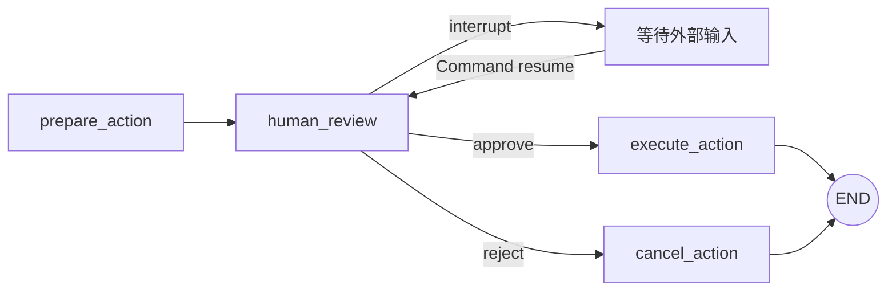

# 第 8 课：interrupt 与人工审批

人工审批流程：



## 8.1 核心条件

使用 `interrupt()` 需要：

1. Graph 配置 Checkpointer；
2. 调用时提供稳定 `thread_id`；
3. interrupt payload 可以 JSON 序列化；
4. 恢复时使用同一个 `thread_id`；
5. 使用 `Command(resume=...)` 提供外部输入。

## 8.2 完整示例

```python
from typing import Literal
from typing_extensions import NotRequired, TypedDict
from langgraph.checkpoint.memory import InMemorySaver
from langgraph.graph import END, START, StateGraph
from langgraph.types import Command, interrupt


class PaymentState(TypedDict):
    order_id: str
    amount: float
    decision: NotRequired[str]
    result: NotRequired[str]


def human_review(state: PaymentState):
    response = interrupt({
        "type": "payment_approval",
        "order_id": state["order_id"],
        "amount": state["amount"],
        "allowed_decisions": [
            "approve",
            "reject",
        ],
    })

    return {
        "decision": response["decision"]
    }


def route_after_review(
    state: PaymentState,
) -> Literal["execute_payment", "reject_payment"]:
    if state["decision"] == "approve":
        return "execute_payment"

    return "reject_payment"


def execute_payment(state: PaymentState):
    return {
        "result": f"已支付 {state['amount']} 元"
    }


def reject_payment(state: PaymentState):
    return {
        "result": "支付已拒绝"
    }


builder = StateGraph(PaymentState)

builder.add_node("human_review", human_review)
builder.add_node("execute_payment", execute_payment)
builder.add_node("reject_payment", reject_payment)

builder.add_edge(START, "human_review")
builder.add_conditional_edges(
    "human_review",
    route_after_review,
)
builder.add_edge("execute_payment", END)
builder.add_edge("reject_payment", END)

graph = builder.compile(
    checkpointer=InMemorySaver()
)
```

第一次执行到暂停：

```python
config = {
    "configurable": {
        "thread_id": "payment-001"
    }
}

paused = graph.invoke(
    {
        "order_id": "ORDER-1001",
        "amount": 299.0,
    },
    config=config,
)

print(paused["__interrupt__"])
```

恢复：

```python
result = graph.invoke(
    Command(
        resume={
            "decision": "approve"
        }
    ),
    config=config,
)

print(result["result"])
```

## 8.3 恢复时节点会重新开始

包含 `interrupt()` 的节点恢复后会从节点开头重新执行，不是从 Python 调用栈的下一行物理续跑。

```python
def review(state):
    print("节点开始")
    result = interrupt("是否批准？")
    print("收到结果", result)
```

输出可能是：

```text
节点开始
节点开始
收到结果 True
```

## 8.4 interrupt 前的副作用必须幂等

危险：

```python
def review(state):
    charge_credit_card()
    approved = interrupt("批准吗？")
```

恢复时可能再次扣款。

更安全：

```text
prepare_action
    -> human_review
    -> execute_action
```

把扣款、发邮件、删除记录等不可逆副作用放到审批后的独立节点。

## 8.5 不要用普通 try/except 包裹 interrupt

```python
# 不推荐
try:
    result = interrupt("继续吗？")
except Exception:
    ...
```

`interrupt()` 使用特殊控制流信号暂停 Graph，宽泛异常捕获可能破坏中断。

## 8.6 审批接口的安全要求

- 验证当前用户是否拥有审批权限；
- 验证任务仍处于 `PENDING`；
- 防止重复提交；
- 使用业务幂等键；
- 不在 payload 中暴露密钥或敏感内部信息；
- 生产环境必须使用持久化 Checkpointer。

---

---

[[07-Streaming流式输出|上一课]] · [[09-Command动态更新与跳转|下一课]]
