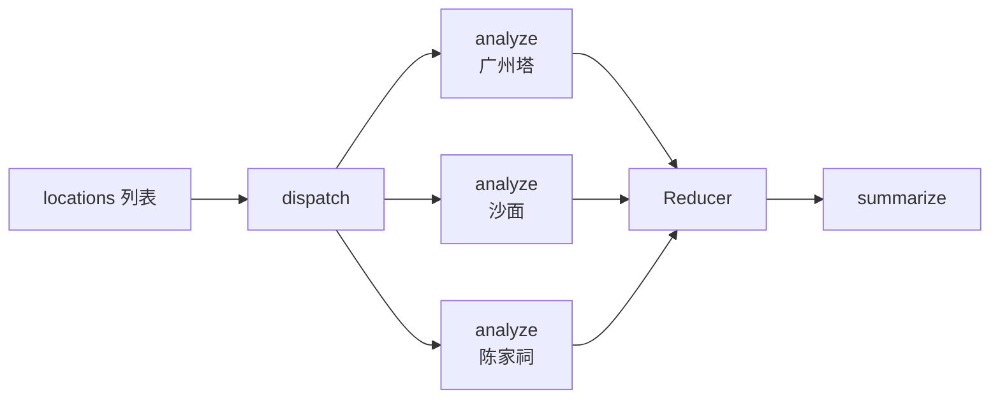

# 第 10 课：Send、并行执行与 Map-Reduce

当任务数量运行时才知道时，可以用 `Send` 动态创建多个 Worker 任务：



## 10.1 完整示例

```python
import operator
from typing import Annotated
from typing_extensions import NotRequired, TypedDict
from langgraph.graph import END, START, StateGraph
from langgraph.types import Send


class Analysis(TypedDict):
    index: int
    location: str
    description: str


class TravelState(TypedDict):
    locations: list[str]
    analyses: Annotated[
        list[Analysis],
        operator.add,
    ]
    summary: NotRequired[str]


class WorkerState(TypedDict):
    index: int
    location: str


def dispatch(
    state: TravelState,
) -> list[Send]:
    return [
        Send(
            "analyze_location",
            {
                "index": index,
                "location": location,
            },
        )
        for index, location in enumerate(state["locations"])
    ]


def analyze_location(state: WorkerState):
    return {
        "analyses": [
            {
                "index": state["index"],
                "location": state["location"],
                "description": (
                    f"{state['location']} 值得游览"
                ),
            }
        ]
    }


def summarize(state: TravelState):
    analyses = sorted(
        state["analyses"],
        key=lambda item: item["index"],
    )

    return {
        "summary": "\n".join(
            f"{item['index'] + 1}. "
            f"{item['location']}："
            f"{item['description']}"
            for item in analyses
        )
    }


builder = StateGraph(TravelState)

builder.add_node("analyze_location", analyze_location)
builder.add_node("summarize", summarize)

builder.add_conditional_edges(
    START,
    dispatch,
)

builder.add_edge(
    "analyze_location",
    "summarize",
)

builder.add_edge("summarize", END)

graph = builder.compile()

result = graph.invoke({
    "locations": [
        "广州塔",
        "沙面",
        "陈家祠",
    ],
    "analyses": [],
})
```

## 10.2 Send

```python
Send(
    "analyze_location",
    {
        "location": "广州塔"
    },
)
```

表示：

> 动态创建一份 `analyze_location` 任务，并把指定 State 传给它。

Worker State 可以不同于主 Graph State，只需要包含 Worker 真正需要的数据。

## 10.3 为什么并行字段需要 Reducer

多个 Worker 同时返回：

```python
{"analyses": [...]}
```

如果没有 Reducer，会发生并发写入冲突或覆盖。

```python
analyses: Annotated[
    list[Analysis],
    operator.add,
]
```

表示把多份列表拼接起来。

## 10.4 Map-Reduce

```text
Map：
对每个地点分别执行 analyze_location

Reduce：
Reducer 汇总 analyses
summarize 生成最终输出
```

## 10.5 并行顺序

并行任务的完成顺序不应被当作业务顺序。

需要稳定输出时：

```python
sorted(
    state["analyses"],
    key=lambda item: item["index"],
)
```

## 10.6 Send 与固定并行边

固定任务数量：

```python
builder.add_edge("start", "search_hotel")
builder.add_edge("start", "search_food")
builder.add_edge("start", "search_attraction")
```

运行时数量不确定：

```python
return [
    Send("worker", {"item": item})
    for item in state["items"]
]
```

---

---

[[09-Command动态更新与跳转|上一课]] · [[11-Subgraph与多Agent|下一课]]
