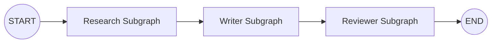

# 第 11 课：Subgraph 与多 Agent

子图是一张作为父图节点运行的 Graph：



## 11.1 子图的价值

- 封装可复用工作流；
- 分离不同 Agent 的职责；
- 隔离私有 State 和消息历史；
- 让不同团队独立开发；
- 降低主 Graph 的复杂度。

## 11.2 共享 State 时直接作为节点

父图和子图共享字段时：

```python
class ParentState(TypedDict):
    topic: str
    notes: list[str]


class ResearchState(TypedDict):
    topic: str
    notes: list[str]
    private_keywords: list[str]
```

编译子图：

```python
research_graph = research_builder.compile()
```

直接加入父图：

```python
parent_builder.add_node(
    "research_agent",
    research_graph,
)
```

父图可以看到共享字段：

```text
topic
notes
```

子图私有字段：

```text
private_keywords
```

不会自动成为父 State 的字段。

## 11.3 State 不同时使用包装节点

```python
class ParentState(TypedDict):
    user_request: str
    result: str


class SubgraphState(TypedDict):
    query: str
    answer: str
```

包装转换：

```python
def call_subgraph(state: ParentState):
    sub_result = subgraph.invoke({
        "query": state["user_request"]
    })

    return {
        "result": sub_result["answer"]
    }
```

## 11.4 子图持久化模式

| `checkpointer` | 模式 | 行为 |
|---|---|---|
| `None` | 每次调用独立，默认 | 每次从新状态开始，但单次调用可继承父图持久化能力 |
| `True` | 按 thread 保留 | 同一 thread 下跨调用累积子图状态 |
| `False` | 无状态 | 没有持久化、恢复和 interrupt |

默认的每次调用独立模式适合大多数一次性子 Agent。

`checkpointer=True` 适合需要持续记忆的子 Agent，但同一个持久子图不应被并行多次调用，否则容易发生 checkpoint namespace 冲突。

## 11.5 多 Agent 的职责划分

一个旅游 Agent 可以拆成：

```text
Supervisor
├── User Profile Agent
├── POI Research Agent
├── Route Planning Agent
├── Budget Agent
└── Reviewer Agent
```

每个子 Agent 只接收完成任务所需的上下文，不要把完整主会话无条件复制给所有 Agent。

## 11.6 Subgraph 不等于 Multi-Agent

```text
Subgraph：
图的模块化机制

Multi-Agent：
多个具有独立职责的 Agent 协作

Subgraph 是实现 Multi-Agent 的方式之一
```

---

---

[[10-Send并行执行与Map-Reduce|上一课]] · [[12-PostgreSQL持久化与生产部署|下一课]]
