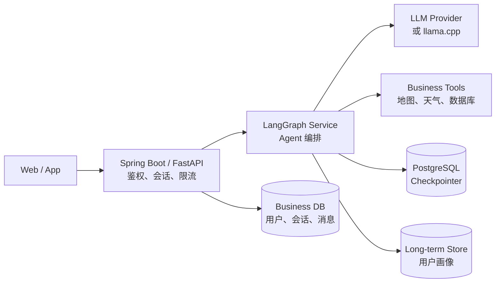

# 第 12 课：PostgreSQL 持久化、重试与生产部署

## 12.1 推荐架构



## 12.2 Checkpoint 数据与业务消息数据分离

Checkpointer 主要负责：

- Graph 状态恢复；
- 会话连续性；
- 工具调用链；
- interrupt 恢复；
- 故障恢复；
- 状态历史。

产品消息表主要负责：

- 聊天记录展示；
- 搜索和分页；
- 已读状态；
- 撤回和删除；
- 内容审核；
- 运营统计。

不要直接把 LangGraph checkpoint 表当作前端聊天记录表。

## 12.3 AsyncPostgresSaver

安装：

```bash
pip install -U \
  langgraph-checkpoint-postgres \
  "psycopg[binary,pool]"
```

初始化：

```python
from langgraph.checkpoint.postgres.aio import (
    AsyncPostgresSaver,
)


async with AsyncPostgresSaver.from_conn_string(
    database_url
) as checkpointer:
    # 首次使用或执行迁移时调用
    await checkpointer.setup()

    graph = builder.compile(
        checkpointer=checkpointer
    )
```

`setup()` 用于创建必要表和执行迁移。生产环境可放入独立初始化或数据库迁移流程，不必在每个请求中执行。

## 12.4 FastAPI 生命周期

```python
import os
from contextlib import asynccontextmanager
from fastapi import FastAPI
from langgraph.checkpoint.postgres.aio import (
    AsyncPostgresSaver,
)


@asynccontextmanager
async def lifespan(app: FastAPI):
    database_url = os.environ["DATABASE_URL"]

    async with AsyncPostgresSaver.from_conn_string(
        database_url
    ) as checkpointer:
        app.state.graph = build_graph(checkpointer)
        yield


app = FastAPI(lifespan=lifespan)
```

数据库初始化可以单独执行：

```python
async with AsyncPostgresSaver.from_conn_string(
    database_url
) as checkpointer:
    await checkpointer.setup()
```

## 12.5 异步节点

```python
async def call_model(state: MessagesState):
    response = await model.ainvoke([
        SystemMessage(content="你是编程助手"),
        *state["messages"],
    ])

    return {
        "messages": [response]
    }
```

FastAPI 中使用：

```python
result = await graph.ainvoke(
    inputs,
    config=config,
)
```

## 12.6 RetryPolicy

```python
from langgraph.types import RetryPolicy


builder.add_node(
    "call_external_api",
    call_external_api,
    retry_policy=RetryPolicy(
        initial_interval=1.0,
        backoff_factor=2.0,
        max_interval=8.0,
        max_attempts=3,
        jitter=True,
    ),
)
```

适合自动重试：

- 网络抖动；
- 临时连接错误；
- 限流后的短暂失败；
- 只读查询；
- 幂等外部调用。

不应默认重试：

- 扣款；
- 发邮件；
- 创建订单；
- 删除数据；
- 发布内容。

副作用节点要么关闭重试，要么使用严格幂等键。

## 12.7 TimeoutPolicy

```python
from langgraph.types import TimeoutPolicy


builder.add_node(
    "slow_node",
    slow_node,
    timeout=TimeoutPolicy(
        run_timeout=60,
        idle_timeout=20,
    ),
)
```

- `run_timeout`：单次节点尝试的总时长上限；
- `idle_timeout`：节点多久没有进展就超时。

节点超时依赖异步取消，因此主要适用于 `async def` 节点。同步阻塞代码无法在当前进程中被安全强制终止。

## 12.8 全局默认策略

```python
builder.set_node_defaults(
    retry_policy=RetryPolicy(
        max_attempts=3
    ),
    timeout=TimeoutPolicy(
        run_timeout=60
    ),
)
```

单个节点通过 `add_node()` 指定的策略会覆盖默认值。

子图不会自动继承父图的节点默认策略，需要在子图中单独设置。

## 12.9 recursion_limit

```python
config = {
    "configurable": {
        "thread_id": conversation_id
    },
    "recursion_limit": 30,
}
```

`recursion_limit` 限制整张 Graph 的执行步数，不是单节点执行时间。

```text
TimeoutPolicy：
限制一次节点尝试的时间

recursion_limit：
限制整张图最多运行多少步
```

## 12.10 持久化强度

执行时可根据版本和部署方式设置持久化强度：

```text
sync：
等待状态持久化后再进入下一步，可靠性更高

async：
状态持久化与下一步并行，延迟与可靠性较均衡

exit：
Graph 结束时持久化，中途崩溃的恢复能力较弱
```

关键审批、支付等流程优先保证持久性；普通聊天可在可靠性和延迟之间折中。

## 12.11 项目结构

```text
agent-service/
├── app/
│   ├── agent/
│   │   ├── state.py
│   │   ├── graph.py
│   │   ├── nodes/
│   │   │   ├── planner.py
│   │   │   ├── executor.py
│   │   │   └── reviewer.py
│   │   ├── tools/
│   │   │   ├── map_tools.py
│   │   │   ├── weather_tools.py
│   │   │   └── database_tools.py
│   │   └── prompts.py
│   ├── api/
│   │   ├── chat.py
│   │   ├── approval.py
│   │   └── schemas.py
│   ├── infrastructure/
│   │   ├── checkpoint.py
│   │   ├── model.py
│   │   ├── store.py
│   │   └── settings.py
│   └── main.py
├── tests/
│   ├── test_nodes.py
│   ├── test_tools.py
│   └── test_graph.py
├── pyproject.toml
├── Dockerfile
└── .env
```

## 12.12 Spring Boot 与 LangGraph 的职责

推荐拆分：

```text
Spring Boot：
用户、鉴权、会话权限、订单、计费、业务数据库、统一网关

Python LangGraph：
Agent 推理、工具编排、状态机、流式事件、人工中断
```

通信方式：

- HTTP；
- SSE；
- WebSocket；
- 消息队列。

前端通常只提交：

```json
{
  "conversationId": "conversation-001",
  "message": "帮我规划广州三日游"
}
```

服务端根据 `conversationId` 查询并校验：

```text
user_id
thread_id
会话权限
```

然后调用 Graph。

## 12.13 生产安全要求

- `thread_id` 不是权限凭证；
- 不把完整内部异常返回客户端；
- 工具参数在服务端再次校验；
- 敏感操作使用人工审批；
- 副作用节点使用幂等键；
- 限制单次请求长度和 Graph 步数；
- 设置 Checkpoint 保留策略，避免无限增长；
- 对敏感 checkpoint 考虑加密和访问控制；
- 对工具、模型和节点建立可观测性与审计日志。

---

---

[[11-Subgraph与多Agent|上一课]] · [[13-LangChain核心组件速查|LangChain 核心组件速查]]
