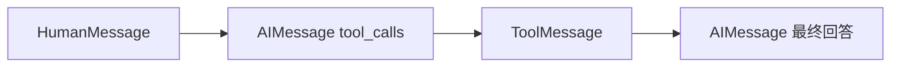

# LangChain 核心组件速查

LangGraph 负责状态与流程编排，而课程中使用的模型、消息和工具抽象主要来自 LangChain。两者经常配合使用：

```text
LangChain：模型、消息、工具等组件抽象
LangGraph：State、节点、边、循环、持久化与人工介入
```

## 消息类型

常见消息类位于 `langchain_core.messages`：

```python
from langchain_core.messages import (
    AIMessage,
    HumanMessage,
    SystemMessage,
    ToolMessage,
)
```

| 消息 | 用途 |
|---|---|
| `SystemMessage` | 向模型提供角色、约束和长期指令 |
| `HumanMessage` | 表示用户输入 |
| `AIMessage` | 表示模型回复，也可能只包含 `tool_calls` |
| `ToolMessage` | 表示某次工具调用的执行结果 |

典型工具调用消息链：



读取消息正文通常使用：

```python
content = message.content
```

不要把消息对象当成普通字典读取：

```python
# 错误
content = message["content"]
```

## ChatOpenAI

安装：

```bash
pip install -U langchain-openai python-dotenv
```

创建模型：

```python
import os
from langchain_openai import ChatOpenAI

model = ChatOpenAI(
    model=os.environ["MODEL_NAME"],
    api_key=os.environ["OPENAI_API_KEY"],
    base_url=os.getenv("OPENAI_BASE_URL"),
    temperature=0,
)
```

同步调用：

```python
response = model.invoke("你好")
print(response.content)
```

异步调用：

```python
response = await model.ainvoke("你好")
```

`invoke()` 和 `ainvoke()` 返回的通常是 `AIMessage`，不是普通字符串。

## 消息列表与解包

调用聊天模型时通常传入消息列表：

```python
response = model.invoke([
    SystemMessage(content="你是编程助手"),
    *state["messages"],
])
```

`*state["messages"]` 会把原消息列表展开到新列表中，避免产生嵌套列表。

## 定义工具

使用 `@tool` 将普通 Python 函数包装为模型可识别的工具：

```python
from langchain_core.tools import tool


@tool
def add(a: int, b: int) -> int:
    """计算两个整数之和。"""
    return a + b
```

模型主要根据以下信息决定是否调用工具：

- 工具名称；
- 文档字符串；
- 参数名称；
- 参数类型与 Schema。

因此工具描述应该说明能力、适用场景和限制。

## bind_tools

```python
tools = [add]
model_with_tools = model.bind_tools(tools)
```

`bind_tools()` 只把工具 Schema 提供给模型，并不会执行 Python 函数。

模型可能返回：

```python
AIMessage(
    content="",
    tool_calls=[
        {
            "name": "add",
            "args": {"a": 12, "b": 8},
            "id": "call_001",
            "type": "tool_call",
        }
    ],
)
```

因此 `AIMessage.content` 为空不一定是错误；真正的输出可能位于 `AIMessage.tool_calls`。

## 工具结果

工具结果应以 `ToolMessage` 返回给模型：

```python
ToolMessage(
    content="20",
    name="add",
    tool_call_id="call_001",
)
```

`tool_call_id` 用于把结果与原始工具请求对应起来。

在 LangGraph 中通常使用 `ToolNode` 自动完成工具查找、参数执行和 `ToolMessage` 封装：

```python
from langgraph.prebuilt import ToolNode

tool_node = ToolNode(tools)
```

## 本地 OpenAI 兼容接口

`ChatOpenAI` 可以指向 llama.cpp 等 OpenAI 兼容服务：

```python
model = ChatOpenAI(
    model="local-chat-model",
    base_url="http://127.0.0.1:8080/v1",
    api_key="not-needed",
    temperature=0,
)
```

模型名应与服务启动时配置的 alias 一致。工具调用还取决于本地模型、聊天模板和兼容接口是否正确支持 `tool_calls`。

## 常见陷阱

- `model.invoke()` 返回 `AIMessage`，不要再次把它错误地包装为 `AIMessage(content=response)`。
- 绑定工具不等于执行工具；实际执行仍需要 `ToolNode` 或自定义执行逻辑。
- 工具描述过于模糊时，模型可能选错工具或完全不调用。
- 工具可能产生真实副作用，发送邮件、扣款和删除数据等操作必须保证幂等并设置审批。
- 本地聊天模型和 Embedding 模型用途不同，Embedding 模型不能作为对话 Agent 使用。

---

[[12-PostgreSQL持久化与生产部署|上一课]] · [[14-综合示例-工具记忆与流式输出|综合示例]]
