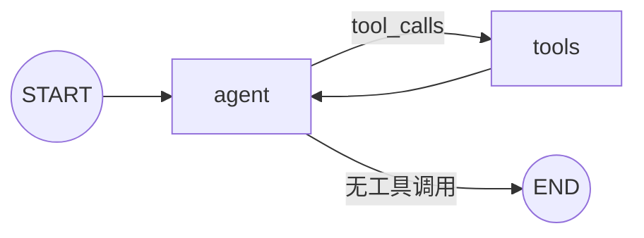

# 综合示例：工具、记忆与流式输出

这个示例把课程中的主要能力组合起来：

- `ChatOpenAI` 调用聊天模型；
- `@tool` 与 `bind_tools()` 提供工具能力；
- `ToolNode` 与 `tools_condition` 构成 ReAct 循环；
- `InMemorySaver` 保存线程状态；
- `thread_id` 隔离会话；
- `messages + updates` 同时输出 Token 与节点进度。



```python
import os

from dotenv import load_dotenv
from langchain_core.messages import SystemMessage
from langchain_core.tools import tool
from langchain_openai import ChatOpenAI
from langgraph.checkpoint.memory import InMemorySaver
from langgraph.graph import MessagesState, START, StateGraph
from langgraph.prebuilt import ToolNode, tools_condition

load_dotenv()


@tool
def search_poi(city: str, keyword: str) -> str:
    """
    在指定城市搜索候选地点。

    当用户要求查找景点、餐厅或酒店时使用。
    """
    return f"{city} 中与 {keyword} 相关的候选地点"


tools = [search_poi]

model = ChatOpenAI(
    model=os.environ["MODEL_NAME"],
    api_key=os.environ["OPENAI_API_KEY"],
    base_url=os.getenv("OPENAI_BASE_URL"),
    temperature=0,
)

model_with_tools = model.bind_tools(tools)


def call_model(state: MessagesState):
    response = model_with_tools.invoke([
        SystemMessage(
            content=(
                "你是旅游规划助手。"
                "涉及具体地点信息时使用搜索工具。"
                "工具结果不足时要明确说明。"
            )
        ),
        *state["messages"],
    ])

    return {
        "messages": [response]
    }


builder = StateGraph(MessagesState)

builder.add_node("agent", call_model)
builder.add_node("tools", ToolNode(tools))

builder.add_edge(START, "agent")
builder.add_conditional_edges("agent", tools_condition)
builder.add_edge("tools", "agent")

graph = builder.compile(
    checkpointer=InMemorySaver()
)


config = {
    "configurable": {
        "thread_id": "travel-conversation-001"
    },
    "recursion_limit": 30,
}


for part in graph.stream(
    {
        "messages": [
            {
                "role": "user",
                "content": "帮我找广州适合夜游的地点。",
            }
        ]
    },
    config=config,
    stream_mode=[
        "messages",
        "updates",
    ],
    version="v2",
):
    if part["type"] == "messages":
        chunk, metadata = part["data"]

        if (
            metadata.get("langgraph_node") == "agent"
            and chunk.content
        ):
            print(
                chunk.content,
                end="",
                flush=True,
            )

    elif part["type"] == "updates":
        for node_name, update in part["data"].items():
            for message in update.get("messages", []):
                for tool_call in getattr(
                    message,
                    "tool_calls",
                    [],
                ):
                    print(
                        f"\n[工具调用] "
                        f"{tool_call['name']} "
                        f"{tool_call['args']}"
                    )

            if node_name == "tools":
                print("\n[工具执行完成]")
```

---

---

[[13-LangChain核心组件速查|上一节]] · [[15-核心概念与故障排查|故障排查]]
