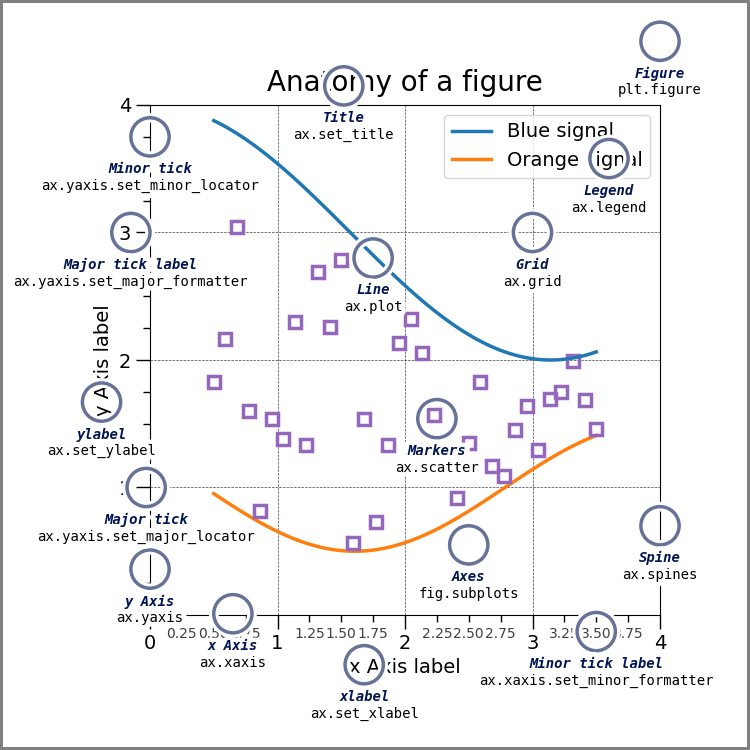

# matplotlib

pandas plot() 接口基于 matplotlib 实现,详见 [[pandas]]。速查参见 [[matplotlib速查与讲义]]。

## 图像绘制流程

```python
import matplotlib.pyplot as plt
```

1. 创建画布 `plt.figure()`,返回 fig 对象,可以不用接收
   - `figsize` - 指定图的长宽
   - `dpi` - 图像的清晰度
2. 绘制图像
   ```python
   plt.plot(x, y)  # x 轴, y 轴的数据
   ```
3. 显示图像 `plt.show()`



## 基础绘图功能

注意要在 plot 以后设置。

`plt.plot()` 可以用字符串传入第三个参数:

- 颜色字符: `'b'` 蓝色, `'m'` 洋红色, `'g'` 绿色, `'y'` 黄色, `'r'` 红色, `'k'` 黑色, `'w'` 白色, `'c'` 青绿色, `'#008000'` RGB 颜色字符串。多条曲线不指定颜色时,会自动选择不同颜色。
- 线型参数: `'-'` 实线, `'--'` 破折线, `'-.'` 点划线, `':'` 虚线。
- 标记字符: `'.'` 点标记, `','` 像素标记(极小点), `'o'` 实心圈标记, `'v'` 倒三角标记, `'^'` 上三角标记, `'>'` 右三角标记, `'<'` 左三角标记 ... 等等

### 显示刻度

```python
plt.xticks(x, **kwargs)
plt.yticks(y, **kwargs)
```

这个要求一一对应。比如绘制 1950 年到 2000 年数据每五年打标签,那么 values 就是 `[1950, 1955, 1960 …]`,而 y_label 就是 `[1950年, 1955年, 1960年 …]`。

### 添加网格

```python
plt.grid(linestyle='-', alpha=1)
```

可以指定网格样式:

- `-` 实线
- `--` 虚线
- `-.` 地图中边界线的样式
- `:` 全是点的线

### 添加标题

```python
plt.title(title, fontsize=12)
```

### 添加 xy 轴标签

```python
plt.xlabel(label, fontsize=12)
plt.ylabel(label, fontsize=12)
```

### 保存图片

```python
plt.savefig(io)
```

### 一个画布里绘制多个

只要多次调用 `plt.plot` 即可,可使用 `color=''` 等指定线的颜色。

### 添加图例

```python
plt.legend(loc="best")  # 指定的选项很多
```

### 多个坐标系显示 - 面向对象的设置方法

在一切操作之前要创建画布,若 `nrows=1, ncols=2`,画布是两个相同 x 但不同 y 的图:

```python
plt.subplots(nrows=, ncols=, figsize=, dpi=)  # 返回元组, fig 画布对象, axes 坐标轴对象
```

- `nrow` 相当于多少个横的 x
- `ncols` 相当于多少个竖下来的 y

`axes` 是个列表了,使用 `axes` 指定在哪个图上操作,像上面 `plt` 那样操作但要加 `set_`,比如:

```python
axes[0].set_title()
axes[0].set_xlabel()
```

### 其它常见图形

仅展示一部分。精华就是 `ctrl+c` 和 `ctrl+v`。参考 [matplotlib gallery](https://matplotlib.org/stable/gallery/index.html)。

#### 柱状图

```python
plt.bar(x, width, align='center', **kwargs)
```

- `x` - 传递的数据
- `width` - 柱状图宽度
- `align` - 对齐方式

#### 直方图

```python
plt.hist(x, bins=None)
```

- `x` - 数据
- `bins` - 组距

#### 饼图

```python
plt.pie(x, labels=, autopct=, colors)
```

- `x` - 数量,自动算百分比
- `labels` - 每部分名称
- `autopct` - 占比显示指定 `%1.2f%%`
- `colors` - 每部分颜色

#### 散点图

```python
plt.scatter(x, y)
```