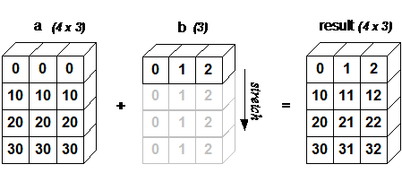

# numpy

## numpy 属性

NumPy 的数组类被称作 ndarray,有以下常用的属性:

- `ndim` - 维度
- `shape` - 形状,即几行几列
- `size` - 大小,数组元素
- `dtype` - 元素类型,datatype
- `itemsize` - 元素大小

比如 `np.arrange(15)`,`reshape(3, 5)` 返回 ndarray 对象可以将 `[0, 1, …, 14]` 组合为 3 行 5 列矩阵。我们也可以通过 `np.array()` 将 py 列表转为 ndarray。

## ndarray 的创建

```python
np.empty(shape, dtype=float, order='C')
```

创建一个未初始化的指定大小的 ndarray 对象。

- `order` - `'C'` 或 `'F'`,代表行或列优先

```python
np.zeros(shape, dtype=float, order='C')
```

创建指定大小的 ndarray 对象,用 0 来填充。

```python
np.ones(shape, dtype=float, order='C')
```

同上,但是用 1 来填充。

```python
np.zeros_like(a, dtype=None, order='K', subok=True, shape=None)
```

创建与给定 ndarray 形状相同的 ndarray,但其中全部用 0 来填充。

```python
np.ones_like()
```

同上,但是用 1 来填充。

```python
np.array(object, dtype=None, copy=True, order=None, subok=False, ndmin=0)
```

把 py 列表转为 ndarray,会复制数据,使用额外数据内存(仅源是 ndarray 时)。

- `object` - 数组或嵌套的序列
- `dtype` - 元素的数据类型,对应 `np.数据类型`
- `copy` - 对象是否需要复制
- `order` - 创建数组的样式,C 为行方向,F 为列方向,A 为任意方向(默认)
- `subok` - 默认返回一个与基类型一致的数组
- `ndmin` - 指定数组的最小维度

```python
np.asarray()
```

用法同上,但是不会复制数据,使用原数据内存(仅源是 ndarray 时)。

```python
np.arange(start, stop, step)
```

类似于 py 的 `range()`,可选参数同 `np.array()` 也有。

```python
np.frombuffer(buffer, dtype=float, count=-1, offset=0)
```

接受 buffer 输入参数,以流的形式读入转化成 ndarray 对象。

```python
np.fromiter(iterable, dtype, count=-1)
```

从可迭代对象中建立 ndarray 对象,返回一维数组。

### np.random 生成随机数

```python
np.random.rand(3, 4)  # 生成指定维度大小(3 行 4 列)的随机多维浮点型数据(二维),rand 固定区间 0.0 ~ 1.0
np.random.randint(-1, 5, size=(3, 4))  # 生成指定维度大小(3 行 4 列)的随机多维整型数据(二维),指定区间 (-1, 5)
np.random.uniform(-1, 5, size=(3, 4))  # 生成指定维度大小的小数范围矩阵
```

```python
np.linspace(start, end, count, endpoint=True)
```

生成等差数列,在 `[start, end]` 结束生成(包左包右)指定个数的元素。

- `endpoint` - 是否包含结束值

```python
np.logspace(start, end, count, base=10)
```

生成等比数列,在 `[base^start, base^end]` 生成(包左包右)指定个数的元素。

可选参数同上。

## numpy 索引切片

### 切片操作

类似于 py 中的列表,但是可以用 `,` 分隔维度,比如 `[0:2, 1:3]`,提取二维下下标 0, 1 的数组,每个数组只保留下标 1, 2 的元素。我们也可以使用 `…` 来选择当前维度所有子维度,比如 `[…, 0]`,提取所有二维下的数组,再提取其中索引为 0 的元素。

### 数组索引

允许接收一个 ndarray 数组,ndarray 中的数字都代表了该 ndarray 的下标,从中挑下来。比如 `ndarr1=[[0, 1, 2], [3, 4, 5]]`;则 `ndarr[ndarr2=[0, 5]]` 结果是 `[0, 5]`。

### 花式索引

也可以在 `[]` 里面使用 `,` 分隔使用多个 ndarray 挑指定元素出来。比如 `ndarr[np.array(0, 1, 1), np.array(0, 0, 1)]` 结果是 `[0, 3, 4]`,当然,可以直接用 `1` 代表 `[1, 1, 1]`(整个维度)。

### 布尔索引

直接在 `[]` 里面写条件判断,用 法:

```python
x[~np.isnan(x)]  # 筛出不是 nan 的元素
x[x < 20] += 20  # 把所有负数加 20
```

## numpy 中的类型转换

使用 ndarray 对象中的 `astype()` 即可,里面传入 `np.数据类型` 或字符串,需要接收返回值。

## numpy 的内置函数

都是用于科学计算,传入 num 或者 ndarray。

### 计算函数

| 函数 | 作用 | 函数 | 作用 |
| --- | --- | --- | --- |
| `np.ceil()` | 向上取整 | `np.floor()` | 向下取整 |
| `np.rint()` | 四舍五入 | `np.abs()` | 绝对值 |
| `np.multiply()` | 乘法/矩阵乘法(行列一致) | `np.divide()` | 除法/矩阵除法(行列一致) |
| `np.where()` | 三元运算符 | | |

### 统计

多维数组默认统计全部维度,可以指定 `axis` 参数,值为 0 按列统计,值为 1 按行统计。

| 函数 | 作用 | 函数 | 作用 |
| --- | --- | --- | --- |
| `np.mean()` | 平均值 | `np.sum()` | 和 |
| `np.max()` | 最大值 | `np.min()` | 最小值 |
| `np.std()` | 标准差 | `np.var()` | 方差 |
| `np.argmax()` | 最大值下标索引 | `np.argmin()` | 最小值下标索引 |
| `np.cumsum()` / `np.cumprod()` | 返回一维数组,每个元素是之前所有元素的累加和/累加积 | | |

### 去重函数

```python
np.unique()  # 去重,返回新副本
```

### 排序

```python
np.sort()  # 返回排序后的副本
ndarray.sort()  # 对 ndarray 对象调用直接在原数据上修改
```

### 迭代器

```python
np.nditer(arr, order='C')  # 返回迭代器,默认行序优先(F 则为列),用于 for in 遍历
```

使用 `ndarray.flat()` 或 `flatten()` (返回拷贝,修改不会影响原数组) 也可以获得迭代器。其中 `order` 参数 `'C'`(行)、`'F'`(列)、`'X'`(原顺序)、`'K'`(内存顺序)。

### 变形

```python
np.reshape()  # 或 ndarray.reshape(),指定转为几行几列,前者返回新数据后者不改变数据修改形状
np.ravel()  # 一维化
```

### 翻转

```python
.transpose()  # 或 ndarray.T,对换数组的维度
.rollaxis  # 向后滚动指定的轴
.swapaxes  # 对换数组的两个轴
```

## numpy 数学运算

### 矩阵乘法

行列数一致的情况下使用 `arr1 * arr2` 或者 `np.multiply(arr1, arr2)`。行列数不一致使用 `.dot(arr1, arr2)` 或者 `@`。

### 矩阵加减法

直接使用数学运算符,行列相同的话就是每个元素对应相 +-。如果形状不同,就会触发广播机制,比如:

