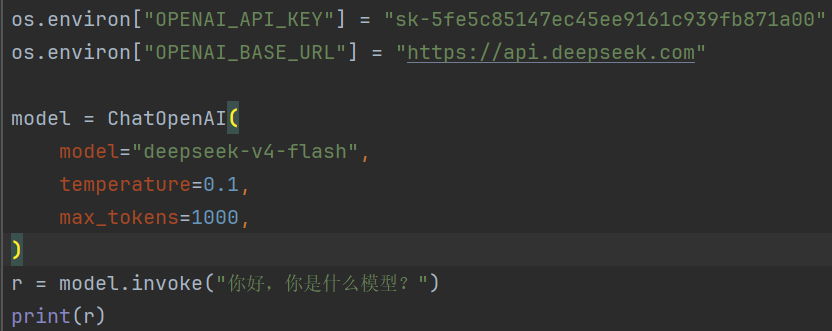
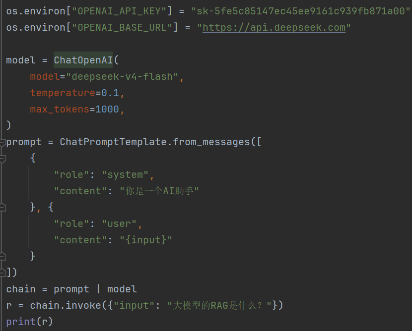

概述  
一般使用langchain包，如果要用第三方Chat**模型的话使用langchain-**  
模型对话  
可以直接使用或者template

|   |
|---|
||
||

可使用以下方式来让输出结果为字符串而不是ChatMessage  
out_put_parser = JsonOutputParser()  
chain = prompt | model | out_put_parser  
RAG  
llm = ChatOpenAI(model="qwen3.6-plus")  
loader = PyPDFLoader(file_path='./PDFs/test.pdf')  
docs = loader.load()  
embeddings = OpenAIEmbeddings(  
model="text-embedding-v4",  
check_embedding_ctx_length=False,  
chunk_size=10,  
)  
splitter = RecursiveCharacterTextSplitter(chunk_size=512, chunk_overlap=128)  
documents = splitter.split_documents(docs)  
print(len(documents))  
# 存储在FAISS向量数据库中  
vector = FAISS.from_documents(documents, embeddings)  
retriever = vector.as_retriever()  
retriever.search_kwargs = {'k': 3}  
prompt_template = """  
你是一个问答机器人。  
你的任务是根据下述给定的已知信息回答用户问题。  
确保你的回复完全依据下述已知信息。不要编造答案。  
如果下述已知信息不足以回答用户的问题，请直接回复"我无法回答您的问题"。  
已知信息:  
{info}  
用户问：  
{question}  
请用中文回答用户问题。  
"""  
template = PromptTemplate.from_template(prompt_template)  
prompt = template.format(info=docs, question="会计师事务所怎样选聘用")  
response = llm.invoke(prompt)  
print(response.content)