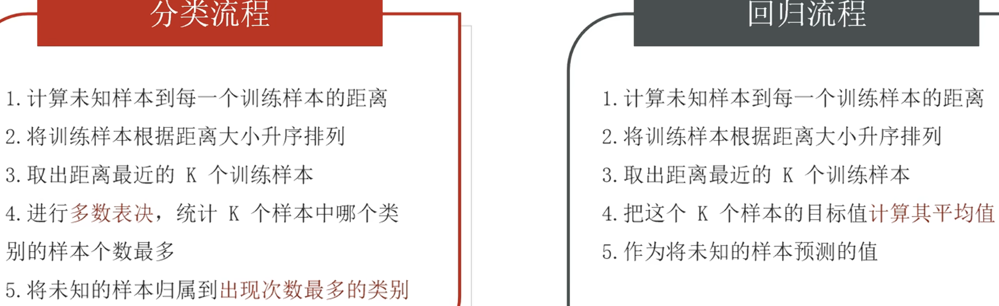
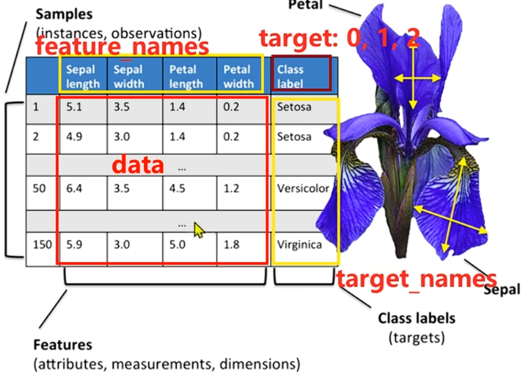

# KNN

## 简介

K-近邻算法 (K Nearest Neighbor)（监督学习,详见 [[概述]]）。

- **解决问题**：分类问题、回归问题
- **算法思想**：如果一个样本在特征空间中的 k 个最相似的样本中的大多数属于某一个类别，则该样本也属于这个类别



## K 值的选择

我们可以认为 K 是多维空间中一个点的范围大小。

- **K 值过小**：用较小邻域中的训练实例进行预测

  - 容易收到异常点影响
  - K 值的减小就意味着整体模型变得复杂，容易发生过拟合
- **K 值过大**：用较大邻域中的训练实例进行预测

  - 易受样本均衡问题
  - K 值的增大就意味着整体的模型变得简单，欠拟合

## KNN 算法 API

### 分类 API

```python
from sklearn.neighbors import KNeighborsClassifier

# n_neighbors: 可选，查询默认使用的邻居数（默认 5）
estimator = KNeighborsClassifier(n_neighbors=3)

# 准备数据集
x_train = [[0], [1], [2], [3]]
y_train = [0, 0, 1, 1]
# 测试集
x_test = [[5]]
# 模型拟合
estimator.fit(x_train, y_train)
# 模型预测
y_pre = estimator.predict(x_test)
```

### 回归 API

```python
from sklearn.neighbors import KNeighborsRegressor

estimator = KNeighborsRegressor(n_neighbors=2)

# 准备数据集
x_train = [[0, 0, 1],
           [1, 1, 0],
           [3, 10, 10],
           [4, 11, 12]]
y_train = [0.1, 0.2, 0.3, 0.4]
# 测试集
x_test = [[3, 11, 10]]
# 模型拟合
estimator.fit(x_train, y_train)
# 模型预测
y_pre = estimator.predict(x_test)
```

## 距离度量

### 欧氏距离 (Euclidean Distance)

两个点在空间中的距离一般是指欧氏距离。

$$d_{12} = \sqrt{\sum_{k=1}^{n} (x_{1k} - x_{2k})^2}$$

### 曼哈顿距离 (Manhattan Distance)

也称城市街道距离，横平竖直计数距离和。

$$d_{12} = \sum_{k=1}^{n} |x_{1k} - x_{2k}|$$

### 切比雪夫距离 (Chebyshev Distance)

国际象棋中国王可以沿八个方向走，通过这种方式最少需要的步数。

$$d_{12} = \max(|x_{1i} - x_{2i}|)$$

### 闵可夫斯基距离 (Minkowski Distance)

对多个距离度量公式概括性的表述。

$$d_{12} = \sqrt[p]{\sum_{k=1}^{n} |x_{1k} - x_{2k}|^p}$$

其中 p 是一个可变参数：

- 当 p = 1 时，是曼哈顿距离
- 当 p = 2 时，是欧氏距离
- 当 $p \to \infty$ 时，是切比雪夫距离

## 特征预处理

### 为什么？

特征的单位或者大小相差较大，或者某特征的方差相比其他的特征要大出几个数量级，容易影响（支配）目标结果，使得一些模型（算法）无法学习到其它的特征。

### 归一化

通过对原始数据进行变换把数据映射到 [mi, mx]（默认为 [0, 1]）之间，适用于小数据集。

$$x' = \frac{x - \min}{\max - \min}$$

$$x'' = x'(\max - \min) + \min$$

数据归一化 API：

```python
from sklearn.preprocessing import MinMaxScaler

# 准备数据集
x_train = [[90, 2, 10, 40],
           [60, 4, 15, 45],
           [75, 3, 13, 46]]
# 创建归一化对象，默认 feature_range=(0, 1)
transfer = MinMaxScaler()
# 归一化
x_train_new = transfer.fit_transform(x_train)
```

### 标准化

通过对原始数据进行标准化，转换为均值为 0 标准差为 1 的标准正态分布的数据，适用于大数据集。

$$x' = \frac{x - \text{mean}}{\sigma}$$

- mean 为特征的平均值
- $\sigma$ 为特征标准差

$$\sigma = \sqrt{\frac{1}{N} \sum_{i=1}^{N} (x_i - \mu)^2}$$

数据标准化 API：

```python
from sklearn.preprocessing import StandardScaler

# 准备数据集
x_train = [[90, 2, 10, 40],
           [60, 4, 15, 45],
           [75, 3, 13, 46]]
# 创建标准化对象，默认 feature_range=(0, 1)
transfer = StandardScaler()
# 标准化
x_train_new = transfer.fit_transform(x_train)
```

## 超参数 k 选择方法

### 交叉验证

一种数据集的分割方法，与 k 无关，将训练集划分为 n 份，拿一份做验证集（测试集）、其他 n-1 份做训练集，目的得到更加准确可信的模型评分。

**交叉验证法原理**：

- 将数据集划分为 cv = 4 份，即是几折交叉验证
- 第一次：把第一份数据做验证集，其他数据做训练
- 第二次：把第二份数据做验证集，其他数据做训练
- ……
- 以此类推，总共训练 4 次，评估 4 次
- 然后使用训练集 + 验证集多次评估模型，取平均值做交叉验证为模型得分

若 k = 5 模型得分最好，再使用全部训练集（训练集 + 验证集）对 k = 5 模型再训练一遍，再使用测试集对 k = 5 模型做评估。

### 网格搜索

模型调参的有力工具，寻找最优超参。只需要将若干参数传递给网格搜索对象，它自动帮我们完成不同超参数的组合、模型训练、模型评估，最终返回一组最优的超参数。

**网格搜索 + 交叉验证的强力组合（模型选择和调优）**

- 交叉验证解决模型的数据输入问题（数据集划分）得到更可靠的模型
- 网格搜索解决超参数的组合
- 两个组合再一起形成一个模型参数调优的解决方案

### 交叉验证网格搜索 API

```text
sklearn.model_selection.GridSearchCV(estimator, param_grid=None, cv=None)
```

对估计器的指定参数值进行详尽搜索。

- **estimator**: 估计器对象
- **param_grid**: 估计器参数 (dict) `{"n_neighbors": [...]}`
- **cv**: 指定几折交叉验证
- **fit**: 输入训练数据
- **score**: 准确率

返回结果：

- **best_score_**: 验证的最好结果
- **best_estimator_**: 最好的参数模型
- **cv_results_**: 每次较长验证后的验证集准确率和训练集准确率的结果

## 案例：鸢尾花的分类



### 导入包

```python
from sklearn.datasets import load_iris  # 加载鸢尾花测试集
import seaborn as sns
import pandas as pd
import matplotlib.pyplot as plt
from sklearn.metrics import accuracy_score  # 模型评估，模型预测准确率
from sklearn.model_selection import train_test_split, GridSearchCV  # 分割训练集和测试集, 交叉验证网格搜索
from sklearn.preprocessing import StandardScaler  # 数据标准化
from sklearn.neighbors import KNeighborsClassifier  # KNN 分类
```

### 查看数据集相关信息

```python
iris_data = load_iris()
# 看看所有的键
# data - 红色框部分 / feature_names - 黄色框部分
# target - 棕色部分对应标签，用 0 1 2 代表 3 种花
# target_names - 标签所对应的话名
print(iris_data.keys())
print(iris_data.data[:5])            # 先看看前五条数据
print(iris_data.target[:5])          # 看前五个标签
print(iris_data.target_names)        # 列表，标签值作为索引就是名字 ['setosa' 'versicolor' 'virginica']
print(iris_data.feature_names)       # 属性的名称
print(iris_data.DESCR)               # 数据集的描述信息
print(iris_data.frame)               # 数据集的框架 None
print(iris_data.filename)            # 数据集的文件名 iris.csv
print(iris_data.data_module)         # 数据集的模型（在哪个包下）sklearn.datasets.data
```

### 展示数据集

```python
iris_data = load_iris()
iris_df = pd.DataFrame(iris_data.data, columns=iris_data.feature_names)
# 给 df 新增一列充当标签列
iris_df['label'] = iris_data.target

# 通过 seaborn 绘制散点图
# 参数：数据集、x 轴、y 轴、分组字段、是否显示拟合线
sns.lmplot(
    data=iris_df, x='sepal length (cm)', y='sepal width (cm)',
    hue='label', fit_reg=True
)
plt.title('iris data')
plt.tight_layout()
plt.show()
```

### 超参选择，模型训练，模型预测

```python
iris_data = load_iris()
x_train, x_test, y_train, y_test = (
    train_test_split(iris_data.data, iris_data.target, test_size=0.3, random_state=0)
)

# 特征工程
# 源数据只有 4 个特征列，都是要用的，不需提取
# 源数据的特征差值不大，这里为了演示进行标准化
transfer = StandardScaler()
x_train = transfer.fit_transform(x_train)  # 兼具训练和转换，保存标准化权重，适用于第一次标准化
x_test = transfer.transform(x_test)        # 重复进行标准化使用，一般用于测试集标准化

# 创建模型不指定超参，后面找
estimator = KNeighborsClassifier()
# 使用交叉验证网格搜索
param_dict = {"n_neighbors": [i for i in range(3, 12, 2)]}
estimator = GridSearchCV(estimator, param_grid=param_dict, cv=4)
# 模型训练
estimator.fit(x_train, y_train)
print(estimator.best_score_)        # 最优评分
print(estimator.best_params_)       # 最优超参组合
print(estimator.best_estimator_)    # 最优估计器对象
print(estimator.cv_results_)        # 具体的交叉验证结果

# 模型预测
y_pre = estimator.predict(x_test)   # 测试集预测
# 新数据集预测
my_data = transfer.transform([[7.8, 2.1, 3.9, 1.6]])  # 注意也要标准化
my_pre = estimator.predict(my_data)
y_pre_proba = estimator.predict_proba(my_data)  # 概率预测
print(y_pre)        # 测试集预测结果
print(my_pre)       # 新数据的预测结果
print(y_pre_proba)  # 测试集预测结果，置信度预测
```

### 模型评估

```python
# 方式一：直接评分，基于训练集特征和数据集标签
train_set_score = estimator.score(x_train, y_train)
# 方式二：基于测试集的标签和预测结果进行评分
test_set_score = accuracy_score(y_test, y_pre)
print(train_set_score)  # 在训练集上评估
print(test_set_score)   # 在测试集上评估
```

## 案例：手写数字识别

### 导包

```python
import matplotlib.pyplot as plt
import pandas as pd
from sklearn.model_selection import train_test_split, GridSearchCV  # 训练集与测试集分割，超参选择器
from sklearn.preprocessing import StandardScaler  # 数据标准化
from sklearn.neighbors import KNeighborsClassifier  # KNN 分类器
from sklearn.metrics import accuracy_score  # 模型评估
import joblib  # 模型保存
```

### 读取源数据，展示指定索引的数据

```python
index = 9
df = pd.read_csv("./data/手写数字识别.csv")

x = df.iloc[:, 1:]  # 全是数据，没有指示是哪个数字的
y = df.iloc[:, 0]   # 全是数字，只有一列

num = y.iloc[index]
data = x.iloc[index].values.reshape(28, 28)
# 具体的灰度图
plt.imshow(data, cmap='gray')
plt.show()
```

### 模型训练并保存

```python
df = pd.read_csv("./data/手写数字识别.csv")

# 数据预处理
x = df.iloc[:, 1:] / 255
y = df.iloc[:, 0]

# 分割数据集, stratify 是参考 y 值进行抽取来保持数据均衡
x_train, x_test, y_train, y_test = train_test_split(
    x, y, test_size=0.2, stratify=y, random_state=0
)

# 模型训练
estimator = KNeighborsClassifier(n_neighbors=3)
estimator.fit(x_train, y_train)

# 模型评估
train_score = estimator.score(x_train, y_train)  # 训练集打分
test_score = accuracy_score(y_test, estimator.predict(x_test))  # 测试集打分
print(train_score)
print(test_score)

# 保存模型
joblib.dump(estimator, "./model/手写数字识别.pkl")
```

### 使用模型推理

```python
# 读取测试数据，记得归一化
img = plt.imread("./data/demo.png")
# 相当于把每个像素都转为一维数组，读取图片就是灰度值在 [0, 1]，不需要归一化
x = img.reshape(1, -1)
# plt.imshow(img, cmap='gray')

# 读取模型
estimator = joblib.load("./model/手写数字识别.pkl")
y_pre = estimator.predict(x)
print(y_pre)
```
