# 决策树

决策树是一种树形结构。树中每个内部节点表示一个特征上的判断，每个分支代表一个判断结果的输出，每个叶子节点代表一种分类结果。

## 决策树的建立过程

- **特征选择**：选取有较强分类能力的特征
- **决策树生成**：根据选择的特征生成决策树

决策树也易过拟合，采用剪枝的方法缓解过拟合。

## 信息熵

随机变量不确定度的度量。

$$H(x) = -\sum_{i=0}^{n} P(x_i) \log_2 P(x_i)$$

其中 $P(x_i)$ 表示数据中类别出现的概率，$H(x)$ 表示信息的信息熵值。

## 信息增益

特征中不同信息种类数量的量化（种类越多信息增益越大）。特征 $a$ 对训练数据集 $D$ 的信息增益 $g(D, a)$，定义为集合 $D$ 的熵 $H(D)$ 与特征 $a$ 给定条件下 $D$ 的熵 $H(D|a)$ 之差。

$$g(D, A) = H(D) - H(D|A)$$

**信息增益 = 熵 - 条件熵**。

$$H(D|A) = \sum_{v=1}^{n} \frac{D^V}{D} H(D^V) = \sum_{v=1}^{n} \frac{D^V}{D} \sum_{k=1}^{K} \frac{C^{kV}}{D^V} \log \frac{C^{kV}}{D^V}$$

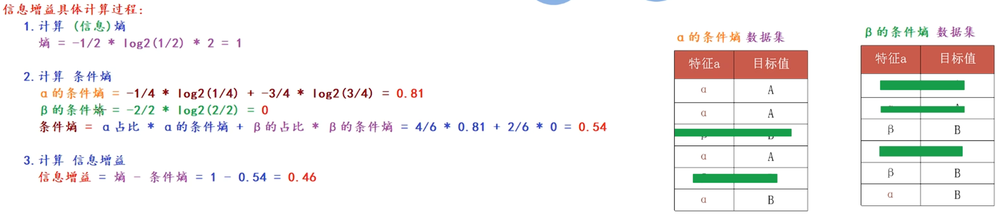

## ID3 决策树 (特征多优先选择)

核心思想：优先参考信息增益大的特征列作为节点。

案例：客户流失率预测

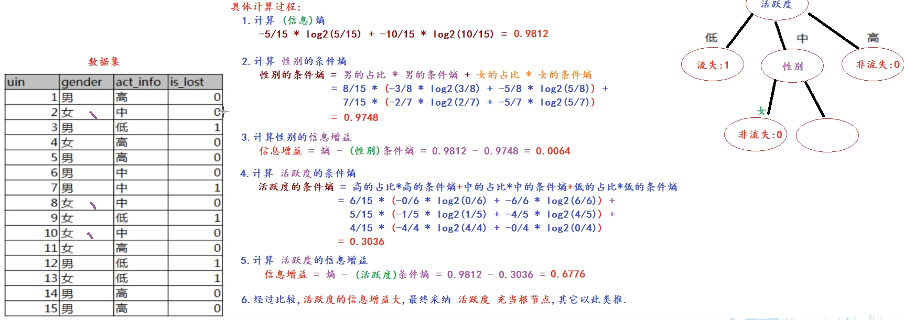

## C4.5 决策树 (特征少优先选择)

### ID3 决策树的不足

偏向于选择种类多的特征作为分裂依据。

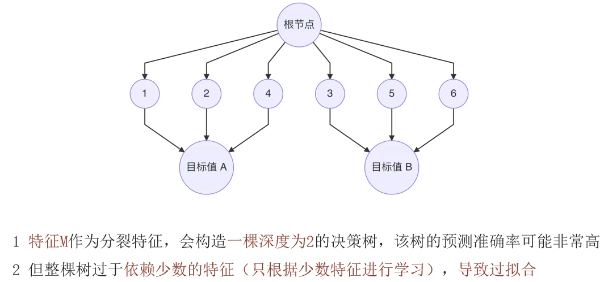

### 信息增益率

信息增益率 = 信息增益 / 特征熵，特征熵 = 惩罚系数。

$$\text{Gain\_Ratio}(D, a) = \frac{\text{Gain}(D, a)}{\text{IV}(a)}$$

- $\text{Gain\_Ratio}(D, a)$ 信息增益率
- $\text{IV}(a) = -\sum_{v=1}^{n} \frac{D^v}{D} \text{Ent}(\frac{D^V}{D})$，IV 为特征熵

本质是：

- 特征的信息增益 / 特征的内在信息
- 相当于对信息增益进行修正，增加一个惩罚系数
- 特征取值个数较多时，惩罚系数较小；特征取值个数较少时，惩罚系数较大
- 惩罚系数：数据集 D 以特征 a 作为随机变量的熵的倒数

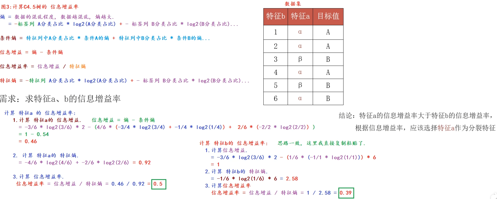

## CART (Classification and Regression Tree) 决策树

可以用于分类，也可以用于回归，使用平方误差最小化策略，采用基尼指数最小化策略。

### 基尼值 Gini(D)

从数据集 D 中随机抽取两个样本，其类别标记不一致的概率。故 Gini(D) 值越小，数据集 D 的纯度越高。

基尼值 = 抽取随机两个样本的概率乘积之和 = 1 - 数据中每种样本被抽取到的概率的平方和。

$$\text{Gini}(D) = \sum_{k=1}^{|y|} \sum_{k' \neq k} p_k p_{k'} = 1 - \sum_{k=1}^{|y|} p_k^2$$

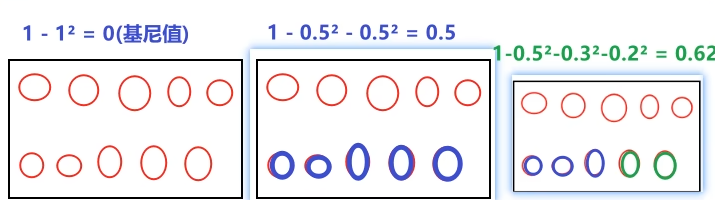

### 基尼指数 Gini_index(D)

选择使划分后基尼指数最小的属性作为最优化分属性。

$$\text{Gini\_index}(D, a) = \sum_{v=1}^{V} \frac{D^v}{D} \text{Gini}(D^v)$$

| | |
| --- | --- |
| 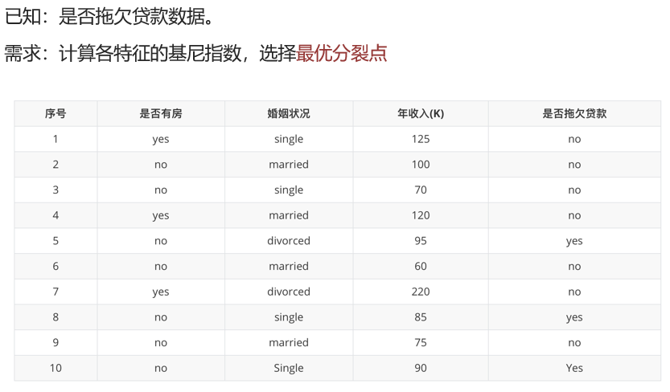 | 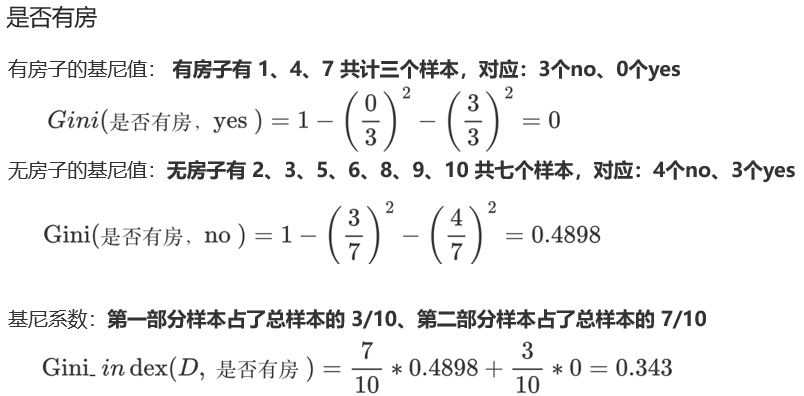 |
| 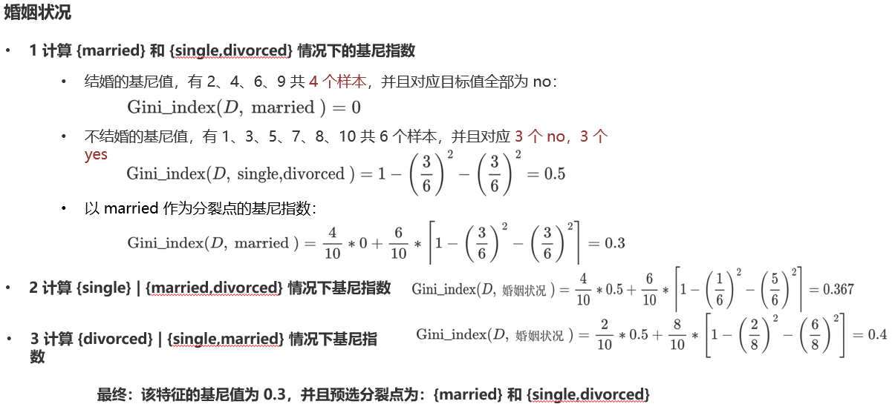 | 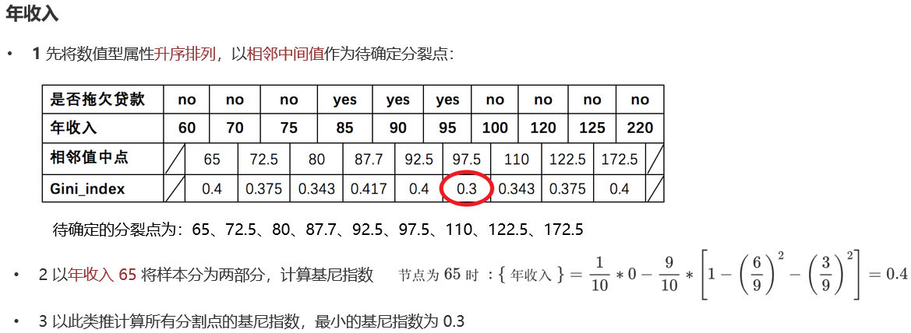 |

### 案例：泰坦尼克号生存率预测

```python
# 数据集字段介绍
# passengerId 乘客编号 / Survived 生存状态 / Pclass 舱位等级（1、2、3）/ Name 姓名
# Sex 性别 / Age 年龄 / SibSp 船上的兄弟姐妹或配偶个数 / Parch 在船上的父母或孩子个数
# Ticket 船票号码 / Fare 票价 / Cabin 客舱 / Embarked 登船港口

data = pd.read_csv("./data/train.csv")
x = data[['Pclass', 'Sex', 'Age']]
y = data['Survived']

# 对 Age 列用平均值填充缺失值
x = x.copy()
x['Age'] = x['Age'].fillna(x['Age'].mean())
# 针对 Sex 进行 one-hot 编码
x = pd.get_dummies(x, 'Sex')

x_train, x_test, y_train, y_test = train_test_split(x, y, test_size=0.2, random_state=23)

# criterion 特征选择标准，"gini" 代表基尼系数（默认），"entropy" 代表信息增益
# min_samples_split 内部节点再划分所需的最小样本数
# min_samples_leaf 叶子节点最少样本数
# max_depth 决策树最大深度
estimator = DecisionTreeClassifier(
    criterion='gini', max_depth=10, max_leaf_nodes=3, random_state=None
)
estimator.fit(x_train, y_train)

# 模型评估
y_pred = estimator.predict(x_test)
print(classification_report(y_test, y_pred))

# 绘制决策树图
plot_tree(estimator, filled=True, max_depth=10)  # filled 代表是否颜色填充
plt.show()
```

## CART 回归树

与分类树的不同在于，该树预测输出的是连续值，使用平方损失，采用叶子节点里的均值作为预测输出。

### 平方损失

$$\text{Loss}(y, f(x)) = (f(x) - y)^2$$

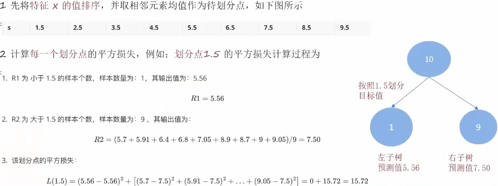 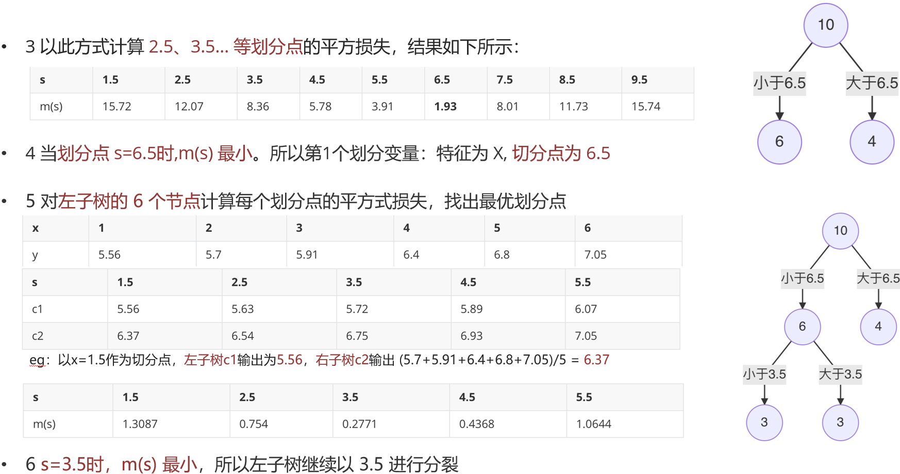  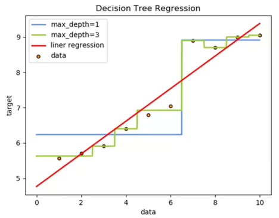

### 案例：回归树与线性回归对比

```python
# 数据准备
x_train = np.array(list(range(1, 11))).reshape(-1, 1)
y_train = np.array([5.56, 5.7, 5.91, 6.4, 6.8, 7.05, 8.9, 8.7, 9, 9.05])

# 模型创建
linear_estimator = LinearRegression()
decision_tree_estimator = DecisionTreeRegressor(max_depth=3)

# 拟合
linear_estimator.fit(x_train, y_train)
decision_tree_estimator.fit(x_train, y_train)

# 预测
x_test = np.arange(0, 10, 0.1).reshape(-1, 1)
linear_y_pred = linear_estimator.predict(x_test)
decision_tree_y_pred = decision_tree_estimator.predict(x_test)

# 评估
plt.scatter(x_train, y_train, c='gray')
plt.plot(x_test, linear_y_pred, c='r', label='LinearRegression')
plt.plot(x_test, decision_tree_y_pred, c='b', label='DecisionTreeRegressor')
plt.legend()
plt.xlabel('data')
plt.ylabel('target')
plt.title('LinearRegression and DecisionTreeRegressor')
plt.show()
```

## 决策树剪枝

### 为什么要剪枝

决策树剪枝是一种防止决策树过拟合的正则化方法，提高其泛化能力。

### 剪枝

把子树的节点全部删掉，使用叶子节点来替换。

### 剪枝方法

**预剪枝**：在决策树生成过程中，对每个节点在划分前先进行估计，若当前节点的划分不能带来决策树泛化性能提升，则停止划分并将当前节点标记为叶节点。

**后剪枝**：先从训练集生成一棵完整的决策树，然后自底向上地对非叶节点进行考察，若将该节点对应的子树替换为叶节点能带来决策树泛化性能提升，则将该子树替换为叶节点。

预剪枝示例

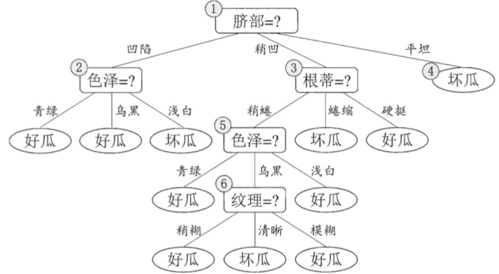 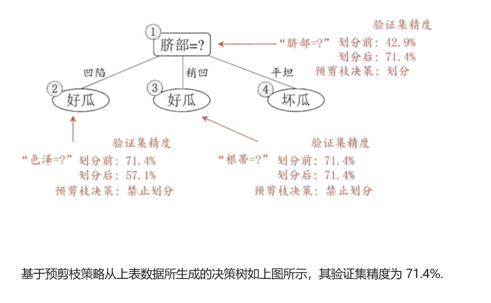

后剪枝示例

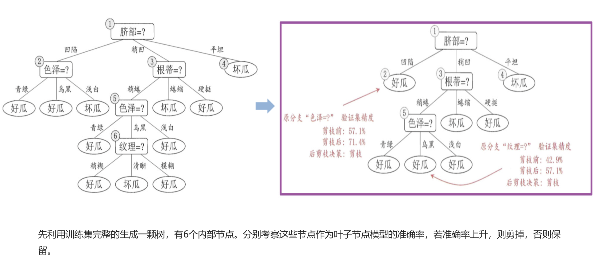

### 剪枝优缺点

**优点**：

- 预剪枝使决策树的很多分支没有展开，降低了过拟合风险，减少了训练、测试时间开销
- 后剪枝比预剪枝保留了更多的分支，欠拟合风险小，泛化性能优于预剪枝

**缺点**：

- 有些分支的当前划分虽然不能提升泛化性能，但后续划分缺有可能导致性能的显著提高，预剪枝带来欠拟合风险
- 后剪枝自底而上，训练时间开销都要大很多
