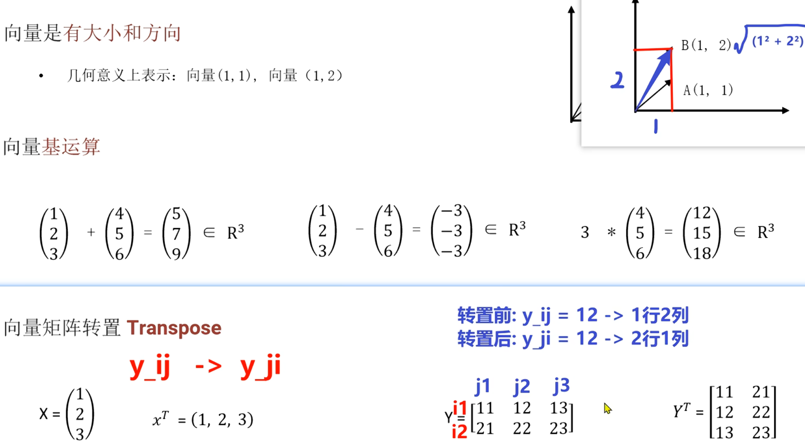
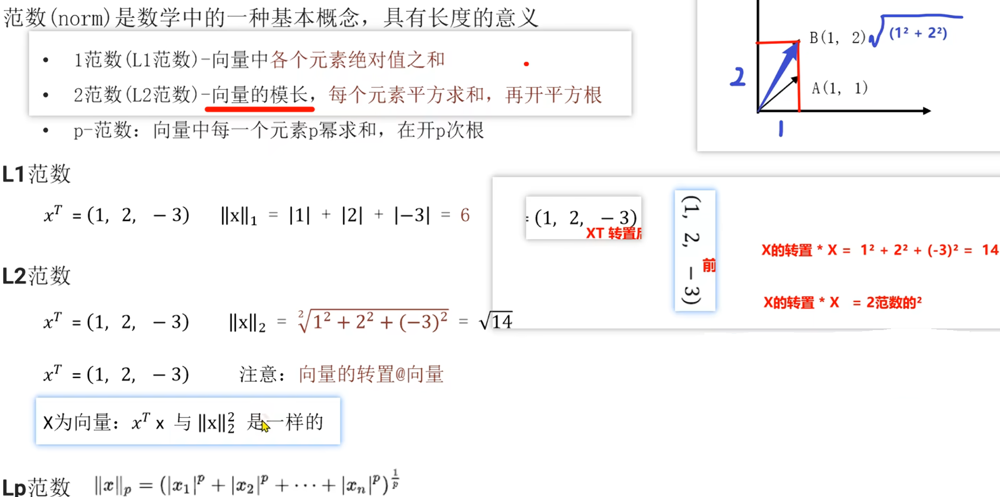

# 数学概念

## 常见的数据表述

- **标量 (scalar)**：一个独立存在的数，只有大小没有方向。
- **向量 (vector)**：向量指一列顺序排列的元素。默认是列向量。
  - 例：张三的数理化成绩信息 `70, 80, 90`，表示为 $(70, 80, 90)^T \in \mathbb{R}^3$。
  - 向量有大小和方向。
- **矩阵 (matrix)**：二维数组。
  - 例：张三、李四的数理化成绩 `70, 80, 90; 75, 85, 95`，表示为 $\begin{pmatrix} 70 & 80 & 90 \\ 75 & 85 & 95 \end{pmatrix} \in \mathbb{R}^{2 \times 3}$。
- **张量 (Tensor)**：数组，张量是基于向量和矩阵的推广。
  - 数学中的张量 $tensor \in \mathbb{R}^{2 \times 3 \times 4}$：2 个 $3 \times 4$ 矩阵、3 个 $2 \times 4$ 或 4 个 $2 \times 3$。

## 偏导

设 $z$ 是关于 $x$ 和 $y$ 的函数 $z = (x - 2)^2 + (y - 3)^2$，求其极小值。

对 $x$ 求偏导：

$$\frac{\partial z}{\partial x} = ((x - 2)^2 + (y - 3)^2)' = (x - 2)^2{}' = 2(x - 2) \quad (x - 2)' = 2(x - 2) \cdot 1 = 0$$

$x = 2$ 时可在 $x$ 方向求得极小值。

对 $y$ 求偏导：

$$\frac{\partial z}{\partial y} = ((x - 2)^2 + (y - 3)^2)' = (y - 3)^2{}' = 2(y - 3) \quad (y - 3)' = 2(y - 3) \cdot 1 = 0$$

$y = 3$ 时可在 $y$ 方向求得极小值。

## 向量

## 范数

## 矩阵

矩阵是数学中的一种基本概念，表达 m 行 n 列的数据等。

矩阵在机器学习中的表达：

$$A = \begin{bmatrix} 1 & 2 \\ 3 & 4 \end{bmatrix} \in \mathbb{R}^{2 \times 2}$$

$$A = \begin{bmatrix} 1 & 2 & 3 \\ 4 & 5 & 6 \end{bmatrix} \in \mathbb{R}^{2 \times 3}$$

- 一个矩阵 m 行 n 列：$A \in \mathbb{R}^{2 \times 3}$。
- 一个数据集 $X \in \mathbb{R}^{N \times D}$：N 表示多少行数据，D 表示特征数。

### 矩阵加法和减法

$$\begin{bmatrix} 1 & 2 & 3 \\ 4 & 5 & 6 \end{bmatrix} + \begin{bmatrix} 1 & 2 & 3 \\ 4 & 5 & 6 \end{bmatrix} = \begin{bmatrix} 2 & 4 & 6 \\ 8 & 10 & 12 \end{bmatrix}$$

$$\begin{bmatrix} 1 & 2 & 3 \\ 4 & 5 & 6 \end{bmatrix} - \begin{bmatrix} 1 & 2 & 3 \\ 4 & 5 & 6 \end{bmatrix} = \begin{bmatrix} 0 & 0 & 0 \\ 0 & 0 & 0 \end{bmatrix}$$

### 矩阵乘法

对应行列元素相乘，然后再加和到一起。

$$A = \begin{bmatrix} 1 & 2 & 3 \\ 4 & 5 & 6 \end{bmatrix} \in \mathbb{R}^{2 \times 3}, \quad B = \begin{bmatrix} 1 & 2 \\ 3 & 4 \\ 1 & 1 \end{bmatrix} \in \mathbb{R}^{3 \times 2}$$

$$C = \begin{bmatrix} 1 \cdot 1 + 2 \cdot 3 + 3 \cdot 1 & 1 \cdot 2 + 2 \cdot 4 + 3 \cdot 1 \\ 4 \cdot 1 + 5 \cdot 3 + 6 \cdot 1 & 4 \cdot 2 + 5 \cdot 4 + 6 \cdot 1 \end{bmatrix} = \begin{bmatrix} 10 & 13 \\ 25 & 34 \end{bmatrix} \in \mathbb{R}^{2 \times 3}$$

$A \in \mathbb{R}^{m \times n}, B \in \mathbb{R}^{n \times d} \Rightarrow A @ B = C \in \mathbb{R}^{m \times d}$。

## 矩阵运算性质

### 矩阵的乘法不满足交换律：$A \times B \neq B \times A$

- 例如：$A \in \mathbb{R}^{5 \times 2}, B \in \mathbb{R}^{2 \times 5}$，则 $A @ B \in \mathbb{R}^{5 \times 5}$，$B @ A \in \mathbb{R}^{2 \times 2}$。
- 特殊条件下满足：$AB = BA$ 的前提是 A、B 是同阶方阵。例如 $A_{2 \times 2} B_{2 \times 2} = B_{2 \times 2} A_{2 \times 2}$。

### 矩阵的乘法满足结合律：$A \times (B \times C) = (A \times B) \times C$

- 例如：$A \in \mathbb{R}^{5 \times 2}, B \in \mathbb{R}^{2 \times 5}, C \in \mathbb{R}^{5 \times 3}$，则 $(A \times B) \times C$ 数据形状为 $\mathbb{R}^{5 \times 3}$。

### 矩阵与单位矩阵相乘等于矩阵本身

- 例如：$A @ I = A$，$I @ A = A$，$I$ 为单位矩阵。

### 矩阵的逆

若矩阵 $A = \begin{bmatrix} 1 & 2 \\ 3 & 4 \end{bmatrix} \in \mathbb{R}^{2 \times 2}$，$A @ B = I$（单位矩阵），则 $B$ 为 $A$ 的逆矩阵，记为 $A^{-1}$。

## 矩阵转置的性质

- $(A^T)^T = A$
- $(A + B)^T = A^T + B^T$
- $(kA)^T = kA^T$（k 为一个常数）
- $(AB)^T = B^T A^T$

比如：

$$\left( \begin{bmatrix} 1 & 2 & 3 \\ 4 & 5 & 6 \end{bmatrix} @ \begin{bmatrix} 1 & 2 \\ 3 & 4 \\ 1 & 1 \end{bmatrix} \right)^T = \begin{bmatrix} 1 & 2 \\ 3 & 4 \\ 1 & 1 \end{bmatrix}^T @ \begin{bmatrix} 1 & 2 & 3 \\ 4 & 5 & 6 \end{bmatrix}^T$$
