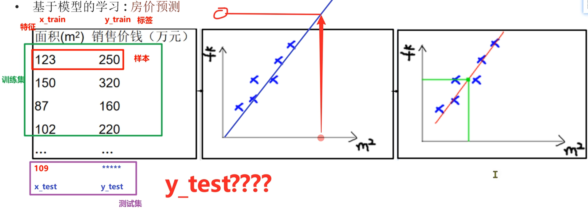
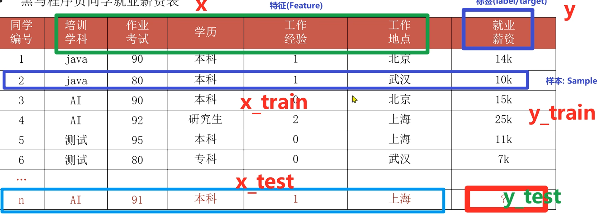
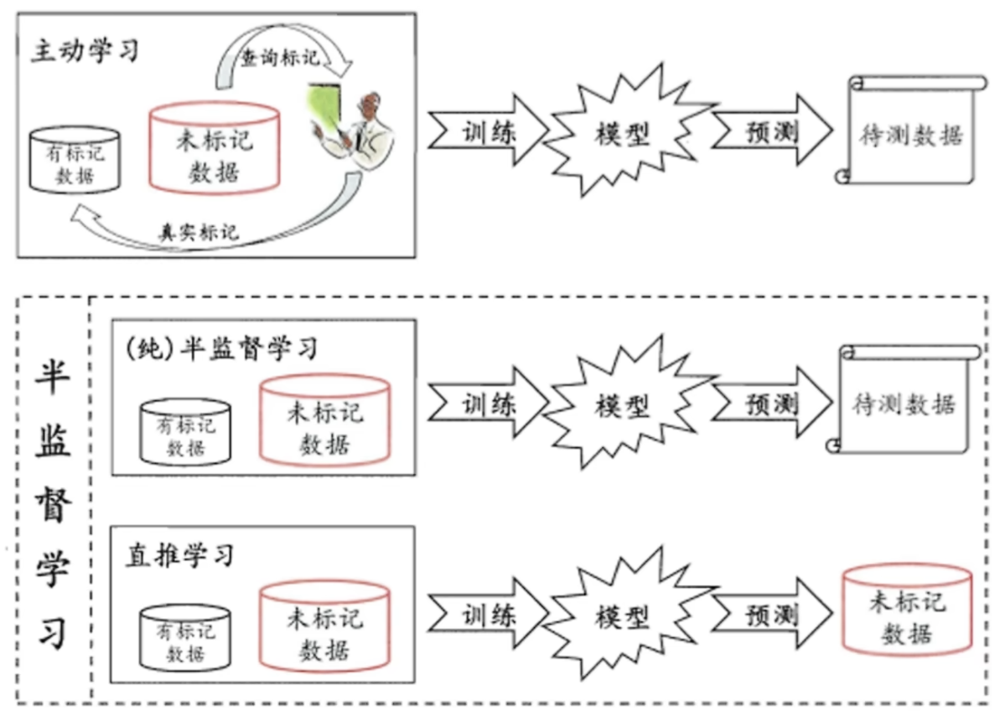
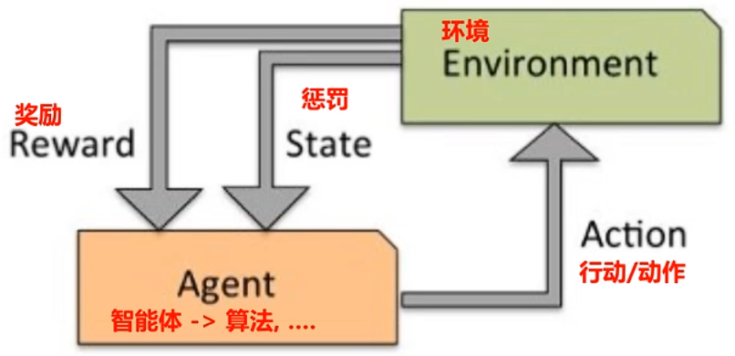
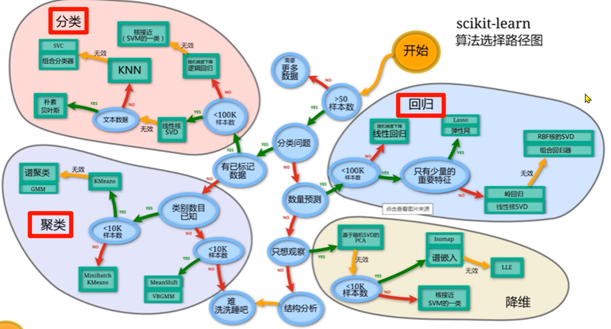

# 概述

## 三大概念

### 人工智能

AI is:

- the field that studies the synthesis and analysis of computational agents that act intelligently
- to use computers to analog and instead of human brain

System that:

- think like humans
- think rationally
- act like humans
- act rationally

### 机器学习

Field of study that gives computers the ability to learn without being explicitly programmed.

### 深度学习

深度神经网络。详见 [[AI/LLM/Prompt Engineering|Prompt Engineering]] 了解大语言模型的应用。

## 学习方式

基于模型的学习



### 一元线性回归

一元线性回归公式：$y = kx + b$

- **k**：斜率，对应 Weight（权重）
- **b**：截距，对应 bias（偏置）

## 历史

- 人工智能之父：约翰·麦卡锡(John McCarthy)
- 机器学习之父：亚瑟·塞缪尔

### 三要素

数据、算法、算力。

## 常用术语



- 样本(Sample):一行数据就是一个样本，多个样本组成数据集
- 特征(Feature):一列数据一个特征，也称为属性
- 标签/目标(Label/Target)

## 算法分类

### 有监督学习

**定义**：输入数据是由输入特征值和目标值所组成，即输入的训练数据有标签的。

**数据集**：需要标注数据的标签/目标值

- 分类问题:目标值(标签值)是不连续的

  - 二分类、多分类
- 回归问题:目标值(标签值)是连续的

### 无监督学习

**定义**：输入数据没有被标记，即样本数据类别未知，没有标签，根据样本间的相似性，对样本集聚类，以发现事务内部的结构及相互关系。

### 半监督学习



- 让专家标注少量数据，利用已经标记的数据(也就是带有类标签)训练出一个模型
- 再利用该模型去套用未标记的数据
- 通过询问领域专家分类结果与模型分类结果做对比

### 强化学习

寻找最短路径(最优解)，以获得更多的奖励。一个分支。



## 建模流程

1. 获取数据
2. 数据基本处理
3. 特征工程
4. 机器学习(模型训练)
5. 模型评估

| 步骤 | 内容 |
| --- | --- |
| 获取数据 | 图像数据、文本数据、… |
| 数据基本处理 | 数据缺失值处理、异常值处理、… |
| 特征工程 | 特征提取、特征预处理、特征降维、… |
| 机器学习 | 线性回归、逻辑回归、决策树、GBDT、… |
| 模型评估 | 回归评测指标、分类评测指标、聚类评测指标 |

## 特征工程

利用专业背景知识和技巧处理数据，让机器学习算法效果最好。

1. 特征提取: 原始数据中提取与任务相关的特征，构成特征向量
2. 特征预处理: 因量纲问题，有些特征对模型影响大，有些影响小
3. 特征降维: 将原始数据的维度降低
4. 特征选择: 原始数据特征很多，选择与任务相关的
5. 特征组合: 把多个特征合并成一个特征

## 拟合问题

拟合 = 模型在训练集和测试集上的表现情况。

- **欠拟合**：模型在训练集、测试集表现都不好，原因是模型过于简单。
- **过拟合**：训练集好，测试集不好，原因是模型太过复杂、数据不纯、训练数据少。
- **泛化**：模型在新数据集上表现好坏的能力。
- **奥卡姆剃刀原则**：给定两个具有相同泛化误差的模型，较简单的模型比较复杂的模型更可取。

## 开发环境

```bash
pip install scikit-learn
```


