# 线性回归

## 简介

**定义**：利用回归方程(函数)对一个或多个自变量(特征值)和因变量(目标值)之间关系进行建模的一种分析方式。涉及的矩阵/向量运算见 [[数学概念]]。

**数学公式**：

$$h_w = w_1 x_1 + w_2 x_2 + w_3 x_3 + \cdots + b = w^T x + b$$

其中 $w$ 为:

$$\begin{bmatrix} b \\ w_1 \\ w_2 \\ \cdots \end{bmatrix}$$

$x$ 为:

$$\begin{bmatrix} b \\ x_1 \\ x_2 \\ \cdots \end{bmatrix}$$

根据矩阵运算 $w^T x$ 为:

$$[b, w_1, w_2, \ldots] @ \begin{bmatrix} 1 \\ x_1 \\ x_2 \\ \cdots \end{bmatrix}$$

- **一元线性回归**：$y = kx + b$，其中 $k$ 为 weight(权重)，$b$ 为 bias(偏置)
- **多元线性回归**：$y = w_1 x_1 + w_2 x_2 + w_3 x_3 + \cdots + b * 1 = w^T x + b$，其中 $b * 1$ 是为了引入偏置项

## 线性回归问题求解

### 线性回归 API

训练数据需转为 [[numpy]] 数组形式:

```python
from sklearn.linear_model import LinearRegression

x_train = [[160], [166], [172], [174], [180]]
y_train = [56.3, 60.6, 65.1, 68.5, 75]
x_test = [[176]]

estimator = LinearRegression()
estimator.fit(x_train, y_train)

print(estimator.coef_)        # 权重 w
print(estimator.intercept_)   # 偏置 b
print(estimator.predict(x_test))
```

## 损失函数

误差 = 预测值 - 真实值。

我们可以通过最小二乘法来得到最优解 k。损失函数的平方展开：

$$\begin{aligned}
L(k, b=-100) &= (160k + (-100) - 56.3)^2 + (166k + (-100) - 60.6)^2 \\
&\quad + (172k + (-100) - 65.1)^2 + (174k + (-100) - 58.5)^2 \\
&\quad + (180k + (-100) - 56.3)^2 \\
&= (160k - 156.3)^2 + (166k - 160.6)^2 + \cdots \\
&= 145416\, k^2 - 281671.6\, k + 136496.32
\end{aligned}$$

令导数为零求最小值：

$$k = -\frac{-281671.6}{2 \times 145416} = 0.9685$$

让损失函数值最小，就相当于直线拟合了所有的点。

如何让损失函数最小？有**正规方程法**与**梯度下降法**两种方式。

### 正规方程法

一元线性回归解析解。损失函数 $J(k, b) = \sum_{i=1}^{m} \left( h(x^{(i)}) - y^{(i)} \right)^2 = \sum_{i=1}^{m} \left( kx^{(i)} + b - y^{(i)} \right)^2$ 的极小值。

对 $k$ 和 $b$ 分别求导设置为 0，得到 2 个方程：

$$\frac{\partial J}{\partial k} = \sum_{i=1}^{m} 2(kx^{(i)} + b - y^{(i)})(kx^{(i)} + b - y^{(i)})' = \sum_{i=1}^{m} (2kx^{(i)2} + 2bx^{(i)} - 2x^{(i)}y^{(i)}) = 0 \quad \text{1式}$$

$$\frac{\partial J}{\partial b} = \sum_{i=1}^{m} 2(kx^{(i)} + b - y^{(i)}) = \sum_{i=1}^{m} (2kx^{(i)} + 2b - 2y^{(i)}) = 0 \quad \text{2式}$$

化简得：

$$k \sum_{i=1}^{m} x^{(i)2} + b \sum_{i=1}^{m} x^{(i)} - \sum_{i=1}^{m} x^{(i)} y^{(i)} = 0 \quad \text{3式}$$

$$k \sum_{i=1}^{m} x^{(i)} + bm - \sum_{i=1}^{m} y^{(i)} = 0 \quad \text{4式}$$

代入身高体重数据后求得 $k = 0.9685$, $b = -85.5$。

**多元线性回归解析解**：对于 $y = w_1 x_1 + w_2 x_2 + \cdots + b = w^T x + b$，损失函数：

$$\text{Loss}(w) = \sum_{i=1}^{n} \left( \hat{y}_i - y_i \right)^2 = \sum_{i=1}^{n} \left( \sum_{j=1}^{d} w_j x_{ij} + b - y_i \right)^2$$

只要让多元线性回归损失函数取最小值，此时的权重 $w$ 就是最优解。求解方法：**正规方程** 或 **梯度下降**。

对于多元线性回归的正规方程解，必须假设矩阵的逆存在。

损失函数普通方式转成矩阵方式（正规方程）：

$$J(w) = \sum_{i=1}^{m} \left( h(x_i) - y_i \right)^2 = \| Xw - y \|_2^2$$

对 $w$ 求偏导并令导数为 0：

$$\begin{aligned}
&2(Xw - y) \cdot X = 0 \quad &\text{……(1)}\\
&2(Xw - y) \cdot (XX^T) = 0 \cdot X^T \quad &\text{……(2)}\\
&2(Xw - y) \cdot (XX^T)(XX^T)^{-1} = 0 \cdot X^T (XX^T)^{-1} \quad &\text{……(3)}\\
&2(Xw - y) = 0 \quad &\text{……(4)}\\
&Xw = y \quad &\text{……(5)}\\
&X^T X w = X^T y \quad &\text{……(6)}\\
&(X^T X)^{-1} (X^T X) \cdot w = (X^T X)^{-1} \cdot X^T y \quad &\text{……(7)}\\
&w = (X^T X)^{-1} \cdot X^T y \quad &\text{……(8)}
\end{aligned}$$

对于上面的 $X$，可以理解为特征列矩阵，比如：

| $x_0$ | $x_1$ (Size, feet²) | $x_2$ (#bedrooms) | $x_3$ (#floors) | $x_4$ (Age, years) | $y$ (Price, $1000) |
|---|---|---|---|---|---|
| 1 | 2104 | 5 | 1 | 45 | 460 |
| 1 | 1416 | 3 | 2 | 40 | 232 |
| 1 | 1534 | 3 | 2 | 30 | 315 |
| 1 | 852 | 2 | 1 | 36 | 178 |

$$X = \begin{bmatrix} 1 & 2104 & 5 & 1 & 45 \\ 1 & 1416 & 3 & 2 & 40 \\ 1 & 1534 & 3 & 2 & 30 \\ 1 & 852 & 2 & 1 & 36 \end{bmatrix}$$

$$w = (X^T X)^{-1} X^T y$$

上面 $X^{(0)}$ 全为 1 是为了留给 $b$ 进行计算。

### 梯度下降法

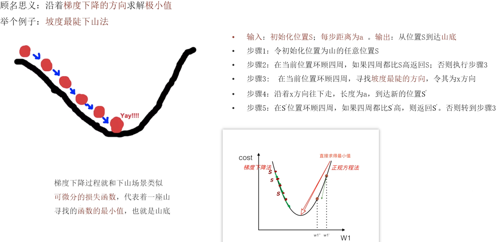

顾名思义：**沿着梯度下降的方向求解极小值**。

打个比方：**坡度最陡下山法**：

- 输入：初始化位置 S；每步距离为 a
- 输出：从位置 S 到达山底
- 步骤 1：令初始化位置为山的任意位置 S
- 步骤 2：在当前位置环顾四周，如果四周都比 S 高返回 S；否则执行步骤 3
- 步骤 3：在当前位置环顾四周，寻找坡度最陡的方向，令其为 x 方向
- 步骤 4：沿着 x 方向往下走，长度为 a，到达新的位置 S'
- 步骤 5：在 S' 位置环顾四周，如果四周都比 S' 高，则返回 S'。否则转到步骤 3

梯度下降过程就和下山场景类似：可微分的损失函数，代表着一座山；寻找的函数的最小值，也就是山底。

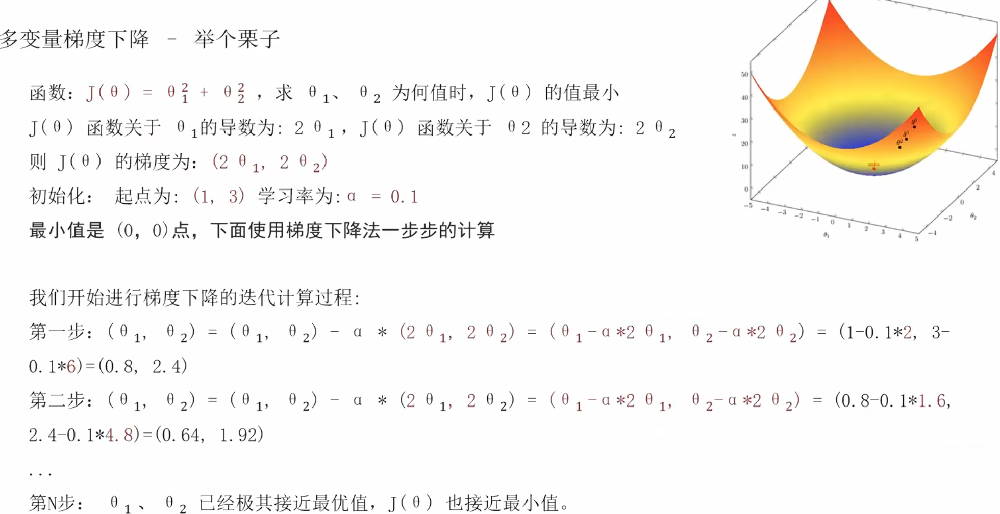

什么是梯度 (gradient / grad)：

- 单变量函数中，梯度就是某一点切线斜率（某一点的导数）；有方向为函数增长最快的方向
- 多变量函数中，梯度就是某一个点的偏导数；有方向：偏导数分量的向量方向

梯度下降公式：

$$\theta_{i+1} = \theta_i - \alpha \frac{\partial}{\partial \theta_i} J(\theta)$$

- 循环迭代求当前点的梯度，更新当前的权重参数
- $\alpha$：**学习率(步长)**，不能太大，也不能太小。机器学习中：$0.001 \sim 0.01$
- 梯度是上升最快的方向，我们需要的是下降最快的方向，所以需要**加负号**

梯度下降案例：

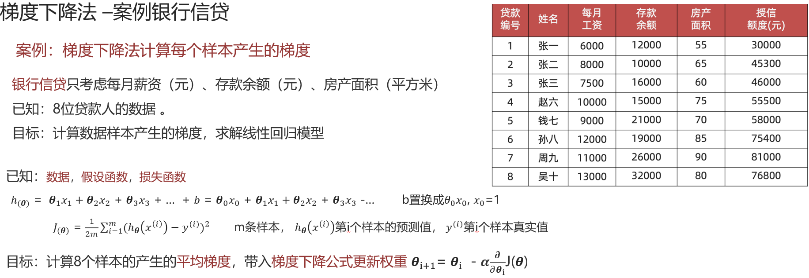 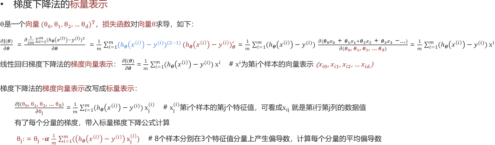 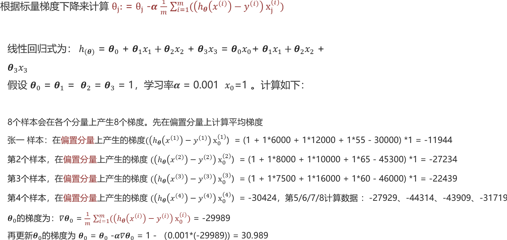 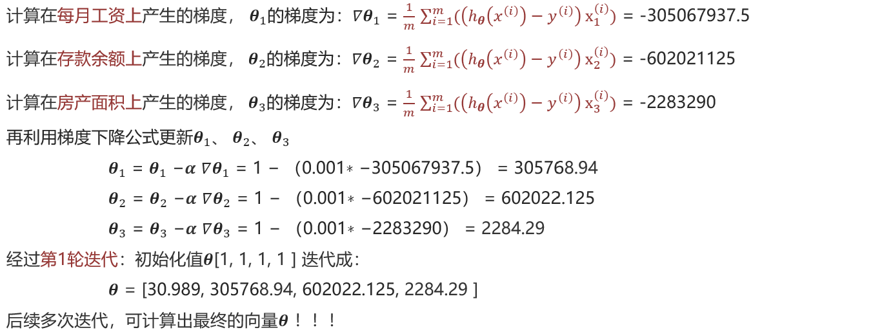

### 梯度下降算法分类

**全梯度下降 FGD** (Full Gradient Descent)：由于使用全部数据集，比较慢。每次迭代时，使用全部样本的梯度值。

$$\theta_{i+1} = \theta_i - \alpha \sum_{j=0}^{m} \left( h_\theta(x_0^{(j)}, x_1^{(j)}, \ldots, x_n^{(j)}) - y_j \right) x_i^{(j)}$$

**随机梯度下降 SDG**：简单，高效，不稳定，每次只用一个样本迭代，容易陷入局部最优解。每次迭代时，随机选择并使用一个样本梯度值。

$$\theta_{i+1} = \theta_i - \alpha \left( h_\theta(x_0^{(j)}, x_1^{(j)}, \ldots, x_n^{(j)}) - y_j \right) x_i^{(j)}$$

**小批量梯度下降 mini-batch**：结合前面两者，使用最多。每次迭代时，随机选择并使用小批量的样本梯度值，从 m 个样本中选择 x 个样本进行迭代(1 < x < m);若 batch_size=1，变成 SDG，=n 变成 FGD。

$$\theta_{i+1} = \theta_i - \alpha \sum_{j=t}^{t+x-1} \left( h_\theta(x_0^{(j)}, x_1^{(j)}, \ldots, x_n^{(j)}) - y_j \right) x_i^{(j)}$$

**随机平均梯度下降 SAG**：初期表现不佳，每轮都结合了上一轮的梯度。每次迭代时，随机选择一个样本的梯度值和以往样本梯度值的均值。

$$\theta_{i+1} = \theta_i - \frac{\alpha}{n} \sum_{j=1}^{m} \left( h_\theta(x_0^{(j)}, x_1^{(j)}, \ldots, x_n^{(j)}) - y_j \right) x_i^{(j)}$$

- 随机选择一个样本，假设选择 D 样本，计算其梯度值并存储到列表:[D]，然后使用列表中的梯度值均值，更新模型参数。
- 随机再选择一个样本，假设选择 G 样本，计算其梯度值并存储到列表:[D, G]，然后使用列表中的梯度值均值，更新模型参数。
- 随机再选择一个样本，假设又选择了 D 样本，重新计算该样本梯度值，并更新列表中 D 样本的梯度值，使用列表中梯度值均值，更新模型参数。
- 以此类推，直到算法收敛。

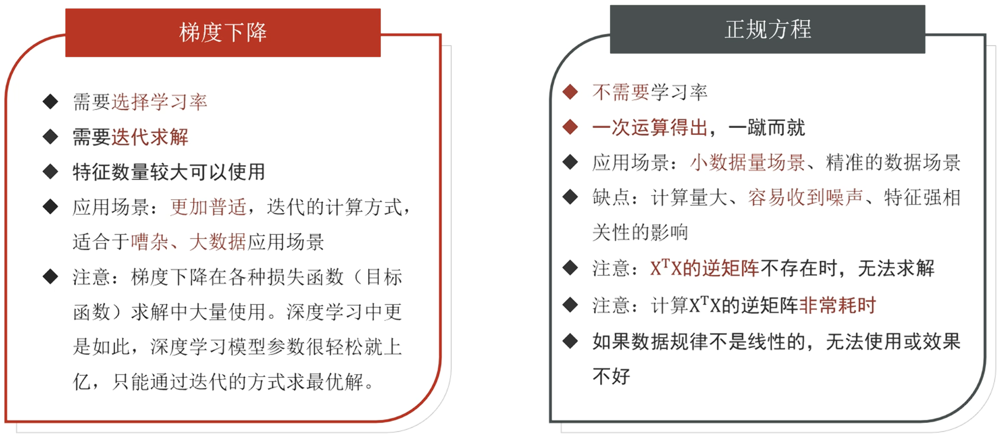

## 评估方法

### 均方误差 (Mean Square Error, MSE)

$$J(w, b) = \frac{1}{m} \sum_{i=0}^{m} \left( h(x^{(i)}) - y^{(i)} \right)^2$$

### 平均绝对误差 (Mean Absolute Error, MAE)

$$J(w, b) = \frac{1}{m} \sum_{0}^{m} \left| h(x^{(i)}) - y^{(i)} \right|$$

### 均方根误差 (Root Mean Square Error, RMSE)

计算对均方误差开根即可。大多数情况下 RMSE > MAE,RMSE 会放大预测误差较大的样本对结果的影响,而 MAE 只是给出了平均误差。

## 线性回归 API

训练数据需转为 [[numpy]] 数组形式:

```python
sklearn.linear_model.LinearRegression(fit_intercept=True)
```

通过正规方程优化。

- **fit_intercept**: 是否计算偏置
- **.coef_**: 回归系数
- **.intercept_**: 偏置

```python
sklearn.linear_model.SGDRegressor(loss="squared_loss", fit_intercept=True, learning_rate="constant")
```

实现了随机梯度下降学习，支持不同的损失函数和正则化惩罚项。

- **loss**: 损失函数
- **fit_intercept**: 是否计算偏置
- **learning_rate**: 学习率策略，可以配置学习率随迭代次数不断变小。如 `"invscaling"`: eta = eta0 / pow(t, power_t=0.25),eta0=0.01 学习率
- **属性同上**

## 欠拟合与过拟合

- **欠拟合**：模型在训练集上表现不好，在测试集上也表现不好。模型过于简单
- **过拟合**：模型在训练集上表现好，在测试集上表现不好。模型过于复杂

- 欠拟合在训练集和测试集上的误差都较大
- 过拟合在训练集上误差较小，而测试集上误差较大

比如：

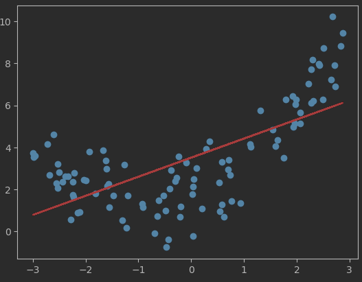

就是欠拟合的，我们可以新增一个特征来增加模型的复杂度，比如：

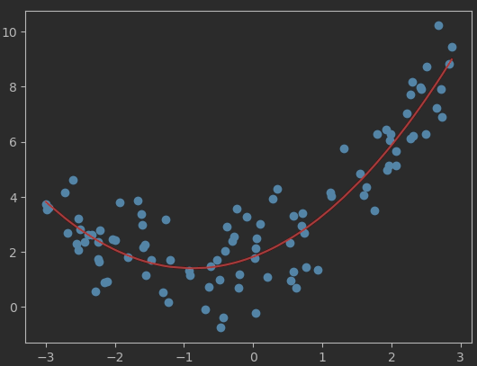

```python
# 模拟欠拟合数据
np.random.seed(23)
x_nums = np.random.uniform(-3, 3, 100)
y_nums = 0.5 * x_nums ** 2 + x_nums + 2 + np.random.normal(0, 1, 100)
X = x_nums.reshape(-1, 1)
# 增加一列特征列，提升模型的复杂度
X2 = np.hstack([X, X ** 2])

estimator = LinearRegression()
estimator.fit(X2, y_nums)
y_pre = estimator.predict(X2)
# 模型评估
plt.scatter(x_nums, y_nums)
# np.sort() 是排序。默认升序
# argsort() 也是排序，但是返回排序后的索引
plt.plot(np.sort(x_nums), y_pre[np.argsort(x_nums)], color="r")
plt.show()
```

下面的例子就是个过拟合的，只需将特征搞得非常多即可模拟。

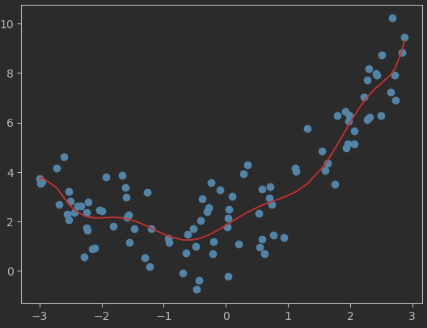

```python
# 增加多列特征列，模拟模型过拟合，剩下的代码同上
X2 = np.hstack([X, X ** 2, X ** 3, X ** 4, X ** 5, X ** 6, X ** 7, X ** 8, X ** 9])
```

可以通过重新清洗数据，增大数据的训练量，正则化，减少特征维度的方式解决。

### L1 正则化

在损失函数中添加 L1 正则化项目。

$$J(w) = MSE(w) + \alpha \sum_{i=1}^{n} \left| w_i \right|$$

$\alpha$ 叫惩罚系数，该值越大则权重调整幅度越大，使某些特征失效，从而达到特征筛选的目的。L1 正则化会使得权重趋向于 0，甚至等于 0，使某些特征失效，达到特征筛选的目的。

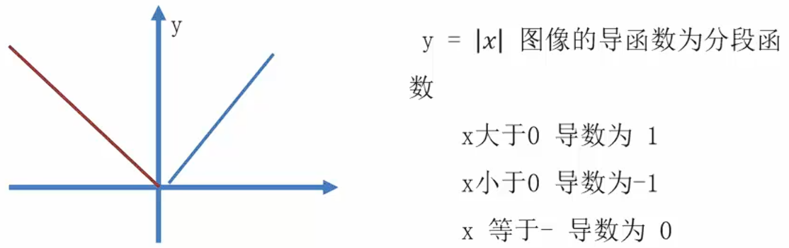

使用 L1 正则化的线性回归模型是 Lasso 回归，位于 `sklearn.linear_model.Lasso`。会将高次方系数变为 0，代码中替换线性模型即可：

```python
estimator = Lasso(alpha=0.005)
```

### L2 正则化

添加 L2 正则化项。

$$J(w) = MSE(w) + \alpha \sum_{i=1}^{n} w_i^2$$

$\alpha$ 叫惩罚系数，该值越大则权重调整幅度越大。L2 正则化会使得权重趋向于 0，但一般不等于 0。

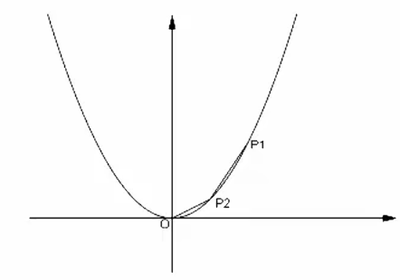

使用 L2 正则化的线性回归模型是岭回归，位于 `sklearn.linear_model.Ridge`:

```python
estimator = Ridge(alpha=10)
```

工程开发中一般使用 L2 正则化。
