# 聚类算法

## K-Means

无监督学习（参见 [[概述]] 中的算法分类），用于数据的聚类。

| | |
| --- | --- |
| 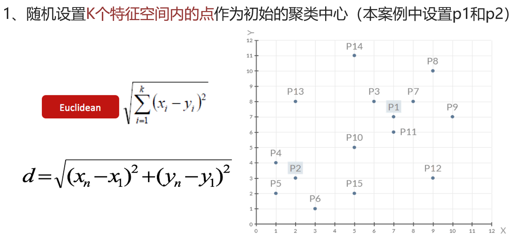 | 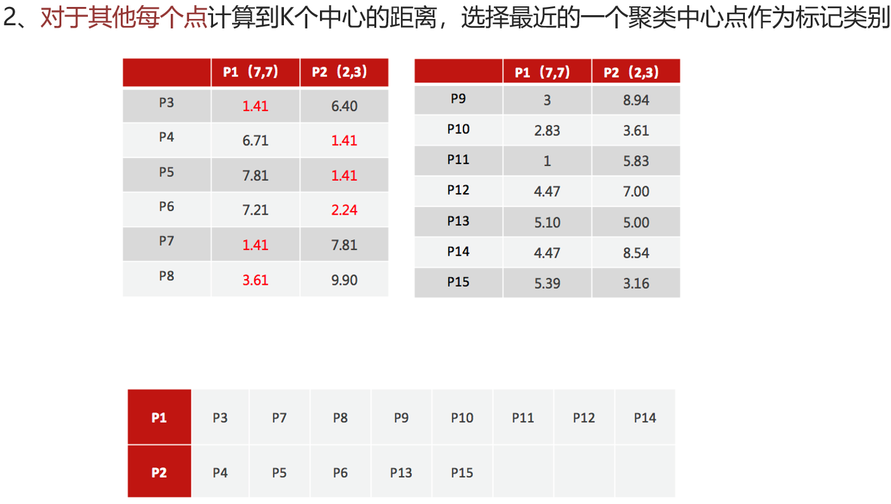 |
| 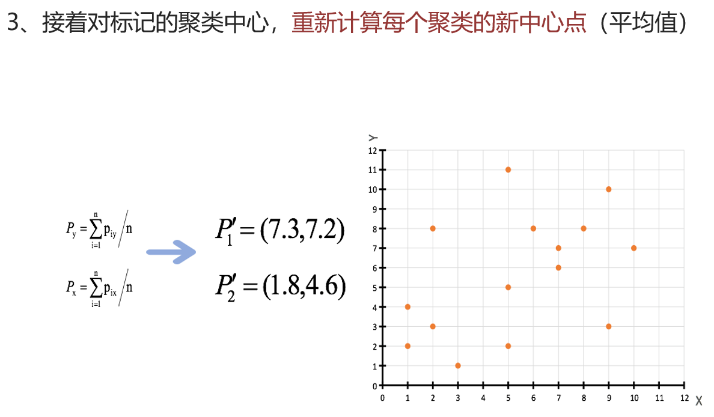 | 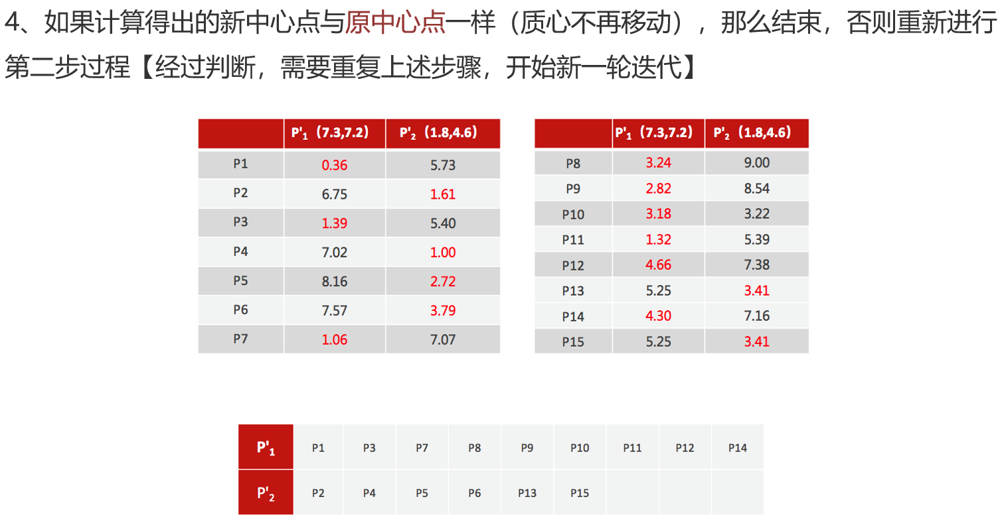 |
| 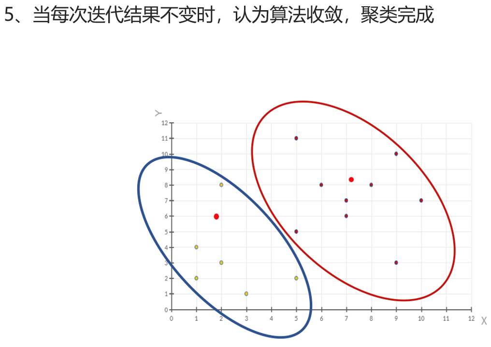 | |

### 代码示例

示例数据通常使用 [[numpy]] 数组(如 make_blobs 生成)。

```python
import matplotlib.pyplot as plt
from sklearn.cluster import KMeans
from sklearn.datasets import make_blobs
from sklearn.metrics import calinski_harabasz_score

# 创建数据集 1000 个样本，每个样本两个特征，4 个质心簇分布在 [[1, 1], [2, 2], [3, 3], [4, 4]]，
# 数据标准差 [0.4, 0.2, 0.2, 0.2]
x, y = make_blobs(
    n_samples=1000, n_features=2,
    centers=[[1, 1], [2, 2], [3, 3], [4, 4]],
    cluster_std=[0.4, 0.2, 0.2, 0.2],
    random_state=23,
)
plt.scatter(x[:, 0], x[:, 1], c=y)
plt.show()

# 创建 KMeans 对象，聚类数量为 4
estimator = KMeans(n_clusters=4, random_state=23)
y_pred = estimator.fit_predict(x)

# 展示预测结果
plt.scatter(x[:, 0], x[:, 1], c=y_pred)
plt.show()
print('CH score:', calinski_harabasz_score(x, y_pred))  # 评价指标，越大越好
```

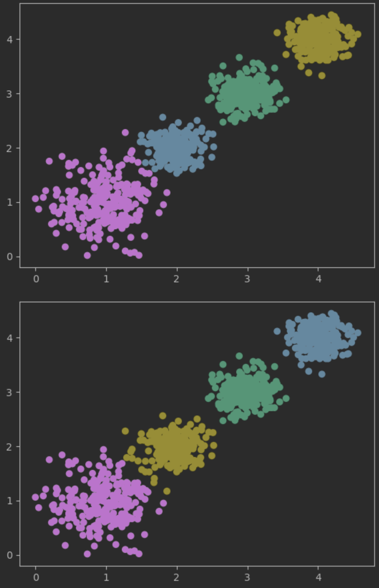

## 聚类算法评估

### 误差平方和 SSE(The sum of squares due to error)

越小越好。SSE 越小，表示数据点越接近它们的中心，聚类效果越好。

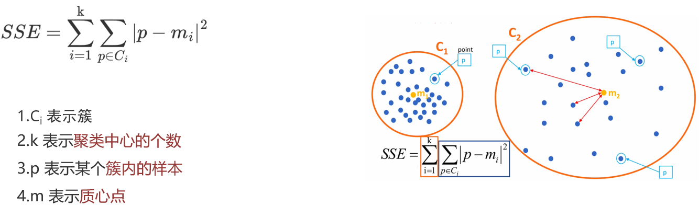

### Elbow Method (K 值确定)

- 对于 n 个点的数据集，迭代计算 k from 1 to n，每次聚类完成后计算 SSE
- SSE 会逐渐变小的，因为每个点都是它所在的簇中心本身
- SSE 变化过程中会出现一个拐点，下降率突然变缓时即认为是最佳 n_clusters 值
- 在决定什么时候停止训练时，判据同样有效，数据通常有更多的噪音，在增加分类无法带来更多回报时，停止增加类别

#### 代码示例

示例数据通常使用 [[numpy]] 数组(如 make_blobs 生成)。

```python
import os
os.environ["OMP_NUM_THREADS"] = '4'
from sklearn.cluster import KMeans
from sklearn.datasets import make_blobs
import matplotlib.pyplot as plt

sse_list = []
x, y = make_blobs(
    n_samples=1000, n_features=2,
    centers=[[-1, -1], [0, 0], [1, 1], [2, 2]],
    cluster_std=[0.4, 0.2, 0.2, 0.2],
    random_state=23,
)
for k in range(1, 100):
    estimator = KMeans(n_clusters=k, max_iter=100, random_state=23)
    estimator.fit(x)
    sse_value = estimator.inertia_
    sse_list.append(sse_value)

plt.xticks(range(0, 100, 10))
plt.grid()
plt.plot(range(1, 100), sse_list)
plt.show()
```

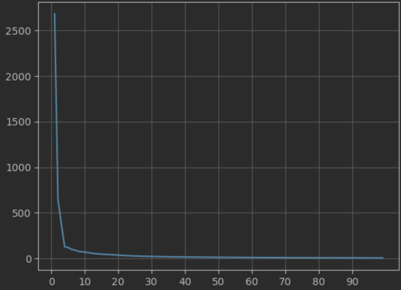

### SC 轮廓系数法 (Silhouette Coefficient)

越大越好。该方法考虑簇内的内聚程度，也考虑簇外的分离程度。

- 对计算每一个样本 i 到同簇内其他样本的平均距离 $a_i$，该值越小，说明簇内的相似程度越大
- 计算每一个样本 i 到最近簇 j 内的所有样本的平均距离 $b_{ij}$，该值越大，说明该样本越不属于其他簇 j
- 根据公式计算该样本的轮廓系数：
- 计算所有样本的平均轮廓系数
- 轮廓系数的范围为：[-1, 1]，SC 值越大聚类效果越好

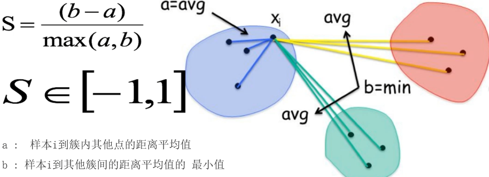

$$S = \frac{b - a}{\max(a, b)}$$

#### 代码示例

示例数据通常使用 [[numpy]] 数组(如 make_blobs 生成)。

```python
import os
os.environ["OMP_NUM_THREADS"] = '4'
from sklearn.cluster import KMeans
from sklearn.datasets import make_blobs
import matplotlib.pyplot as plt
from sklearn.metrics import silhouette_score

sc_list = []
x, y = make_blobs(
    n_samples=1000, n_features=2,
    centers=[[-1, -1], [0, 0], [1, 1], [2, 2]],
    cluster_std=[0.4, 0.2, 0.2, 0.2],
    random_state=23,
)
for k in range(2, 100):
    estimator = KMeans(n_clusters=k, max_iter=100, random_state=23)
    estimator.fit(x)
    y_pred = estimator.predict(x)
    sc_list.append(silhouette_score(x, y_pred))

plt.xticks(range(0, 100, 10))
plt.grid()
plt.plot(range(2, 100), sc_list)
plt.show()
```

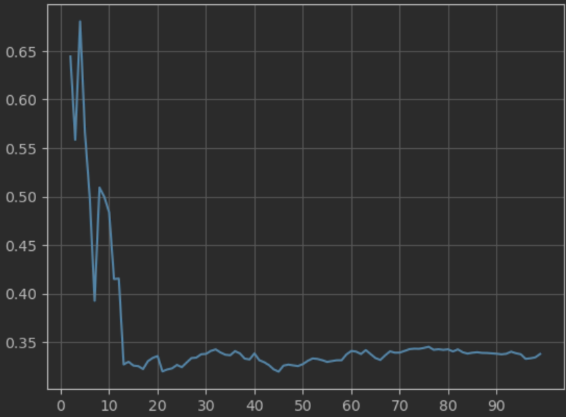

### CH 轮廓系数法 (Calinski-Harabasz Index)

越大越好。考虑簇内的内聚程度、簇外的离散程度、质心个数。

$$CH(k) = \frac{SSB}{SSW} \cdot \frac{m - k}{k - 1}$$

$$SSW = \sum_{i=1}^{m} \| x_i - C_{p_i} \|^2$$

$$SSB = \sum_{i=1}^{k} n_j \| C_j - \bar{X} \|^2$$

- SSW 相当于 SSE，簇内距离(簇内的内聚程度，越小越好)
- SSB 是簇间距离(簇与簇之间的离散程度，越大越好)

| 符号 | 含义 | 符号 | 含义 |
| --- | --- | --- | --- |
| $C_{p_i}$ | 质心 | $C_j$ / $\bar{X}$ / $n_j$ | 质心 / 质心的均值 / 样本个数 |
| $x_i$ | 某个样本 | m | 样本数量 |
| | | k | 质心个数 |

#### 示例代码

```python
import os
os.environ["OMP_NUM_THREADS"] = '4'
from sklearn.cluster import KMeans
from sklearn.datasets import make_blobs
import matplotlib.pyplot as plt
from sklearn.metrics import calinski_harabasz_score

ch_list = []
x, y = make_blobs(
    n_samples=1000, n_features=2,
    centers=[[-1, -1], [0, 0], [1, 1], [2, 2]],
    cluster_std=[0.4, 0.2, 0.2, 0.2],
    random_state=23,
)
for k in range(2, 100):
    estimator = KMeans(n_clusters=k, max_iter=100, random_state=23)
    estimator.fit(x)
    y_pred = estimator.predict(x)
    ch_list.append(calinski_harabasz_score(x, y_pred))

plt.xticks(range(0, 100, 10))
plt.grid()
plt.plot(range(2, 100), ch_list)
plt.show()
```

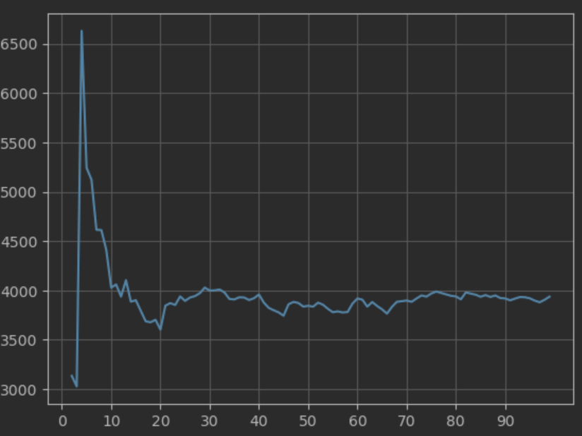
