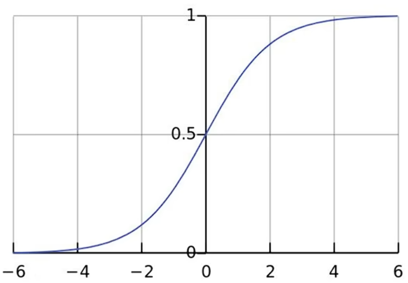
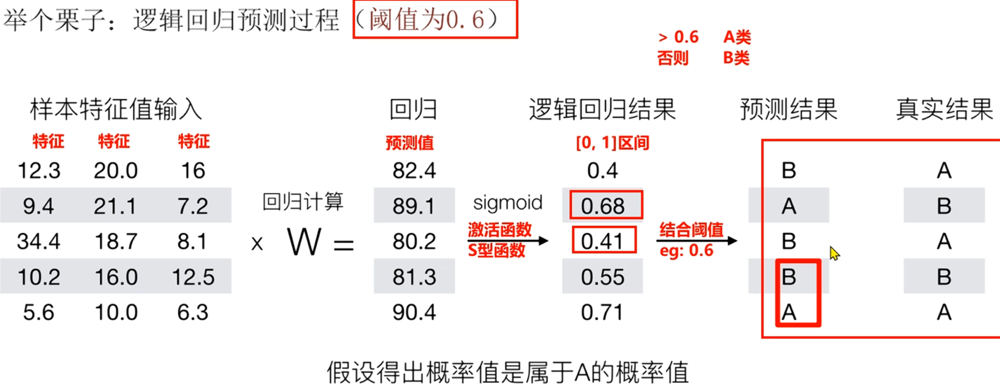
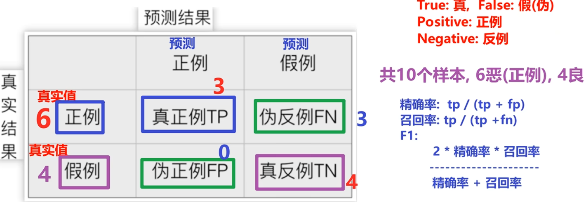
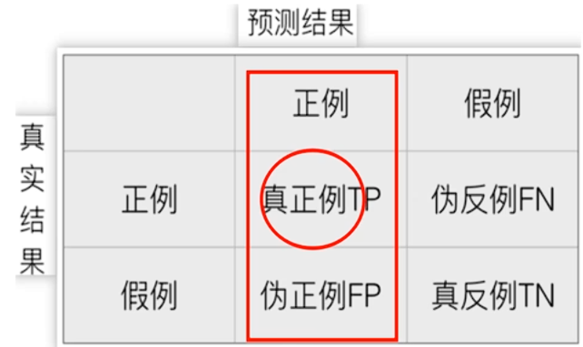
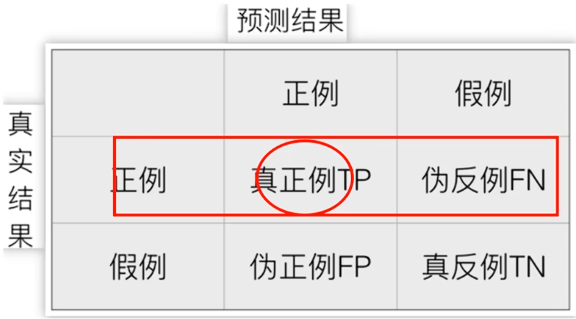
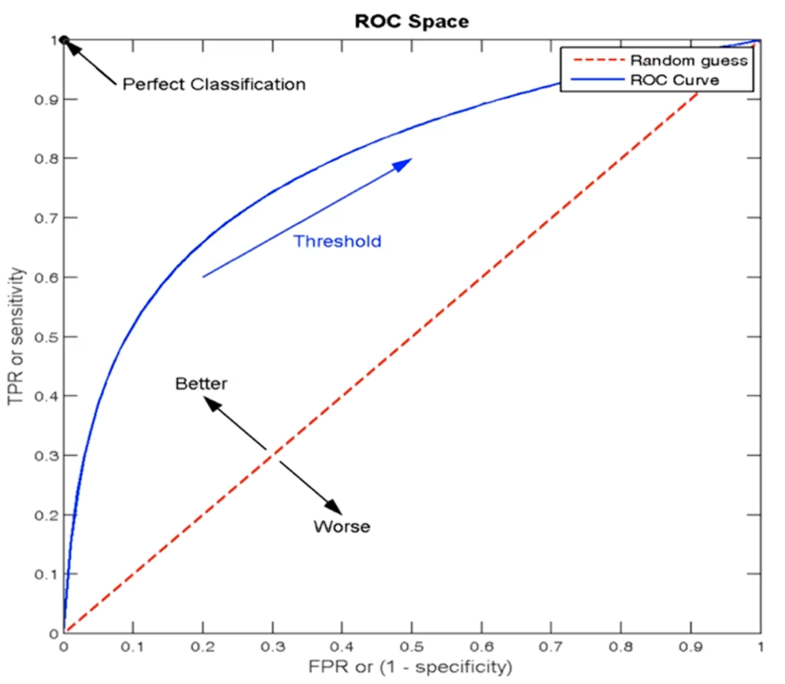

# 逻辑回归

## 数学基础

### 激活函数 sigmoid

用于将 $(-\infty, +\infty)$ 映射到 $(0, 1)$。

$$f(x) = \frac{1}{1 + e^{-x}}$$

$$f'(x) = f(x) (1 - f(x))$$



### 极大似然估计

根据观测到的结果来估计模型中的未知参数。

举个例子：假设有一枚不均匀的硬币，出现正面的概率和反面的概率是不同的。假定出现正面的概率为 $\theta$，抛了 6 次得到如下现象 $D = \{正, 反, 反, 正, 正, 正\}$。每次投掷事件都是相互独立的。则根据产生的现象 D，来估计参数 $\theta$ 是多少？

$$P(D|\theta) = P(正, 反, 反, 正, 正, 正) = P(正|\theta) P(反|\theta) P(反|\theta) P(正|\theta) P(正|\theta) = \theta^4 (1 - \theta)^2$$

求得当 $\theta = \frac{2}{3}$ 时取得极大值。

## 逻辑回归原理

**逻辑回归 (Logistic Regression)** 是一种分类模型，把线性回归的输出作为逻辑回归的输入，输出是 (0, 1) 之间的值。

### 基本思想

- 利用线性模型 $f(x) = w^T x + b$ 根据特征的重要性计算出一个值
- 再使用 sigmoid 函数将 $f(x)$ 的输出值映射为概率值

设置阈值（如 0.5），输出概率值大于 0.5 则将未知样本输出为 1 类，否则输出为 0 类。

### 逻辑回归的假设函数

$$h(w) = \text{sigmoid}(w^T x + b)$$

线性回归的输出作为逻辑回归的输入。



### 损失函数

损失函数 = - 极大似然估计函数。

$$L(L) = -\sum_{i=1}^{m} \left( y_i \log p_i + (1 - y_i) \log(1 - p) \right)$$

$$p_i = \text{sigmoid}(w^T x + b)$$

每个样本预测值有 A、B 两种类别，$y_i \in \{0, 1\}$ 是真实类别对应的结果，$p_i$ 概率值越大越好。

## 分类问题评估

### 混淆矩阵



```text
sklearn.metrics.confusion_matrix
```

### 精确率 (Precision)



对正例样本的预测准确率。

$$P = \frac{TP}{TP + FP}$$

### 召回率



指的是预测为真正例样本占所有真实样本的比重。

$$P = \frac{TP}{TP + FN}$$

### F1-score

综合上面两个数据来评估模型综合预测能力。

$$F1 = \frac{2 \times \text{Precision} \times \text{Recall}}{\text{Precision} + \text{Recall}}$$

#### 演示代码

```python
from sklearn.metrics import confusion_matrix, precision_score, recall_score, f1_score

# 10 个样本，6 个正例，4 个反例
# 评估结果：预测对 3 个正例，4 个反例
y_train = ['P', 'P', 'P', 'P', 'P', 'P', 'N', 'N', 'N', 'N']
y_pred = ['P', 'P', 'P', 'N', 'N', 'N', 'N', 'N', 'N', 'N']
# 用标签标记正例和反例
label = ['P', 'N']
print(f"混淆矩阵:{confusion_matrix(y_train, y_pred, labels=label)}")
print(f"精确率:{precision_score(y_train, y_pred, pos_label='P')}")
print(f"召回率:{recall_score(y_train, y_pred, pos_label='P')}")
print(f"f1:{f1_score(y_train, y_pred, pos_label='P')}")
```

### ROC 曲线与 AUC 指标

- 正样本中被预测为正样本的概率 TPR (True Positive Rate)
- 负样本中被预测为正样本的概率 FPR (False Positive Rate)

通过这两个指标可以描述模型对正/负样本的分辨能力。



**ROC 曲线 (Receiver Operating Characteristic Curve)** 是一种常用于评估分类模型性能的可视化工具。ROC 曲线以模型的真正率 TPR 为纵轴、假正率 FPR 为横轴，它将模型在不同阈值下的表现以曲线的形式展现出来。

**AUC 曲线下面积 (Area Under the ROC Curve)** ROC 曲线的优劣可以通过曲线下的面积 AUC 来衡量，AUC 越大表示分类器性能越好。

- 当 AUC = 0.5 时，表示分类器的性能等同于随机猜测
- 当 AUC = 1 时，表示分类器的性能完美，能够完全正确地将正负例分类

## 逻辑回归 API

```text
sklearn.linear_model.LogisticRegression(solver='liblinear', penalty='l2', C=1.0)
```

- **solver**: 损失函数优化方法。`liblinear` 对小数据集训练快，`sag` 和 `saga` 对大数据集更快。`sag` / `saga` 支持 L2 正则化或没有；`liblinear` / `saga` 支持 L1
- **penalty**: 正则化种类，L1 或 L2
- **C**: 正则化力度

默认将类别少的当做正例。

## 案例：电信客户流失预测

```python
# 原始数据集里有以下列
# CustomerID 客户 ID / Gender 性别 / partner_att 配偶是 att 用户 / dependents_att 家人是 att 用户
# internet_att / internet_other 是否使用 att 的互联网服务
# Paymentbank / creditcard / electroinc 付款方式 / MonthlyCharges 每月话费
# TotalCharges 累计话费 / Contract_Month / 1year 用户使用月度 / 年度合约
# StreamingTv / StreamingMovies 是否使用在线视频或者电影 APP / Churn 客户转化的 flag

churn_df = pd.read_csv("./data/churn.csv")
churn_df.head()

# one-hot 编码，把单列男女分为男女两列
churn_df = pd.get_dummies(churn_df, columns=["Churn", "gender"])
# 多了废话特征，删除没用的
churn_df.drop(["Churn_No", "gender_Male"], inplace=True, axis="columns")
churn_df.rename(columns={"Churn_Yes": "flag"}, inplace=True)

x = churn_df[["Contract_Month", "internet_other", "PaymentElectronic"]]
y = churn_df["flag"]
x_train, x_test, y_train, y_test = train_test_split(x, y, test_size=0.2, random_state=0)

estimator = LogisticRegression()
estimator.fit(x_train, y_train)
y_pred = estimator.predict(x_test)

# 模型评估，都在 sklearn.metrics 里
print(f"训练准确率：{estimator.score(x_train, y_train)}")
print(f"预测准确率：{accuracy_score(y_test, y_pred)}")
print(f"精确率：{precision_score(y_test, y_pred)}")
print(f"召回率：{recall_score(y_test, y_pred)}")
print(f"F1 值：{f1_score(y_test, y_pred)}")
# macro avg: 宏平均，不考虑样本权重，直接求平均
# weighted avg: 样本权重平均，考虑样本权重，求平均
print(f"分类评估报告：\n{classification_report(y_test, y_pred)}")
```

### 模型评估输出

```text
训练准确率：0.7740504082357117
预测准确率：0.7693399574166075
精确率：0.5892116182572614
召回率：0.3858695652173913
F1值：0.4663382594417077
分类评估报告：

              precision    recall  f1-score   support

       False       0.81      0.90      0.85      1041
        True       0.59      0.39      0.47       368

    accuracy                           0.77      1409
   macro avg       0.70      0.65      0.66      1409
weighted avg       0.75      0.77      0.75      1409
```
