# 集成学习

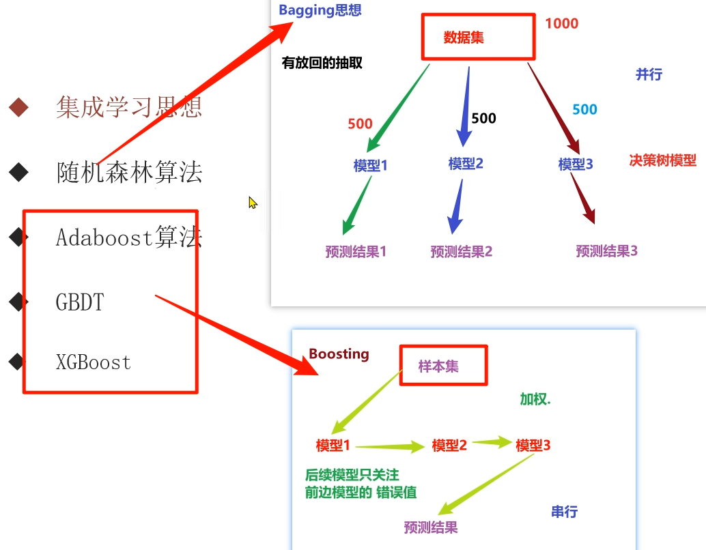

集成学习是机器学习中的一种思想，它通过多个模型的组合形成一个精度更高的模型，参与组合的模型称为基学习器（弱学习器）。训练时，使用训练集依次训练出这些弱基学习器，对未知的样本进行预测时，使用这些基学习器联合进行预测。

| | |
| --- | --- |
| 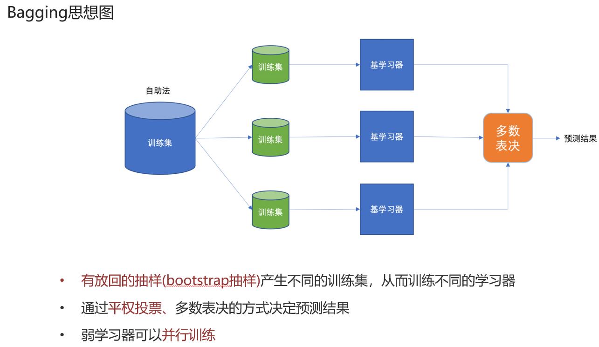 | 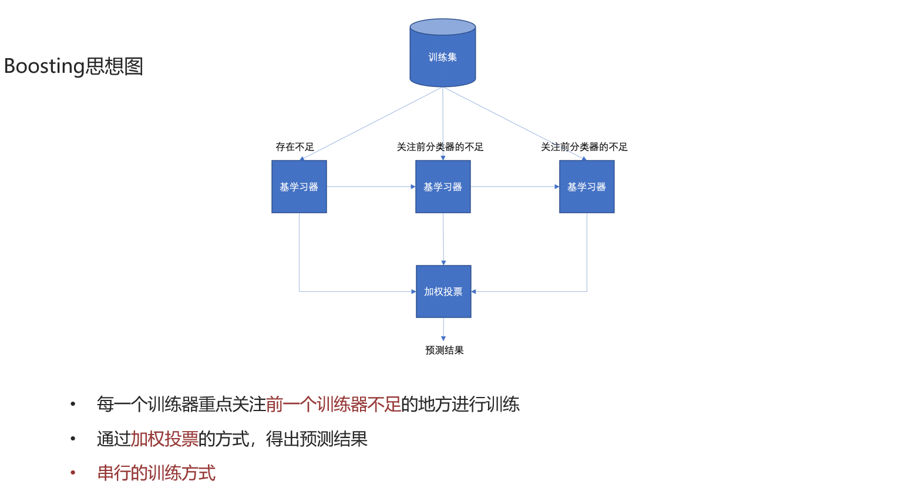 |
| 有放回采样训练 | 全部样本，根据前一轮学习结果调整数据重要性 |
| 所有学习器平权投票 | 所有学习器加权投票 |
| 并行，每个学习器无依赖关系 | 串行，学习有先后顺序 |

## 随机森林

基于 Bagging，采用决策树。

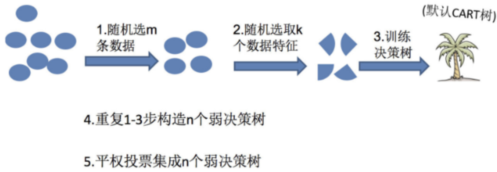

### 示例

```python
data = pd.read_csv('./data/train.csv')
x = data[['Pclass', 'Sex', 'Age']].copy()
y = data['Survived']
x['Age'] = x['Age'].fillna(x['Age'].mean())
x = pd.get_dummies(x, 'Sex')

x_train, x_test, y_train, y_test = train_test_split(x, y, test_size=0.2, random_state=23)

# n_estimators: 决策树的数量（默认 10）
# Criterion: entropy 或 gini（默认）
# max_depth: 树的最大深度（默认尽可能生长）
# max_features: 考虑的最大特征数（默认 auto，即 sqrt），可以是 sqrt、log2
# bootstrap: 是否有放回抽样
# min_samples_split: 节点分裂所需的最小样本数（默认 2）
# min_samples_leaf: 叶子节点的最小样本数（默认 1），节点数目小于它就会被剪枝
# min_impurity_decrease: 节点划分最小不纯度（默认 1e-7）
estimator = RandomForestClassifier()
estimator.fit(x_train, y_train)  # 要记得再训练一次

# 网格搜索
gs_estimator = GridSearchCV(
    estimator,
    param_grid={'max_depth': [3, 5, 7, 9], 'n_estimators': [30, 50, 60, 90, 110]},
    cv=2,
)
gs_estimator.fit(x_train, y_train)
y_pred = gs_estimator.predict(x_test)

# 评估
print(gs_estimator.score(x_test, y_test))
# 获取最佳参数
print(gs_estimator.best_params_)
```

## Adaboost

Adaptive Boosting（自适应提升）基于 Boosting 思想实现，通过逐步提高那些被前一步分类错误的样本的权重来训练，基于决策树，一般做二叉树。

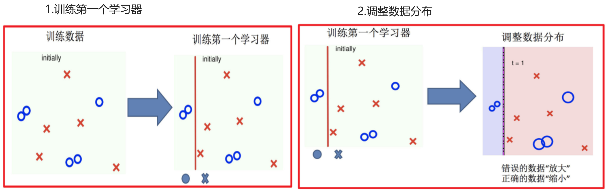 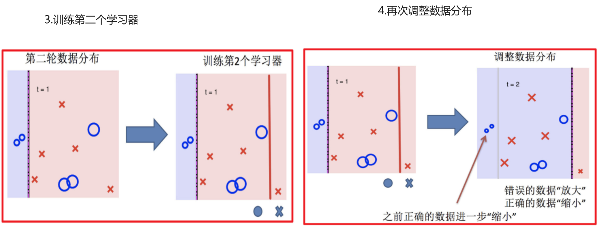 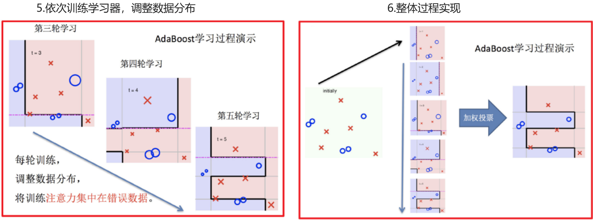 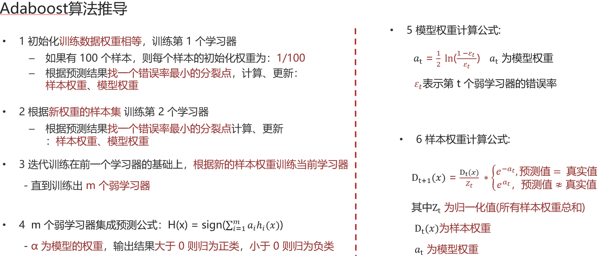

下面以构建第 1、2 个弱分类器为例：

| | |
| --- | --- |
| 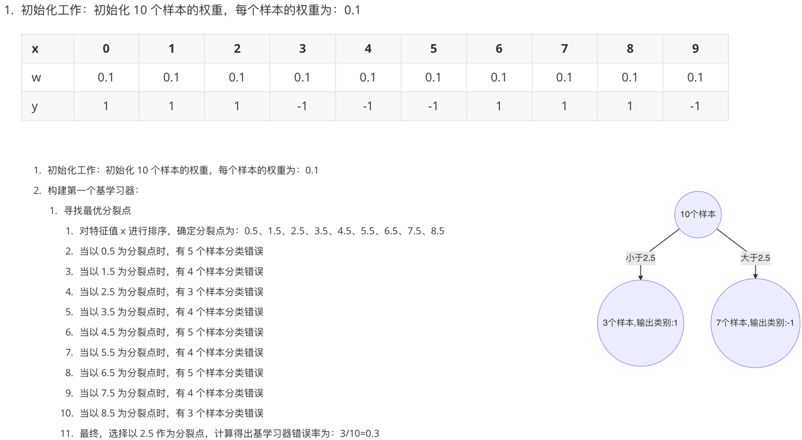 | 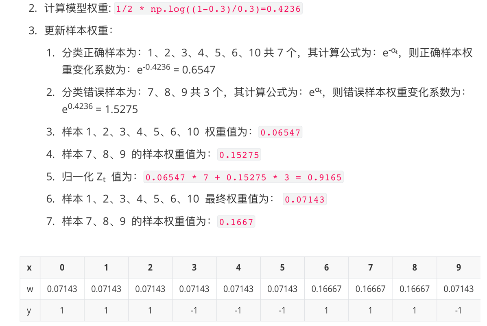 |
| 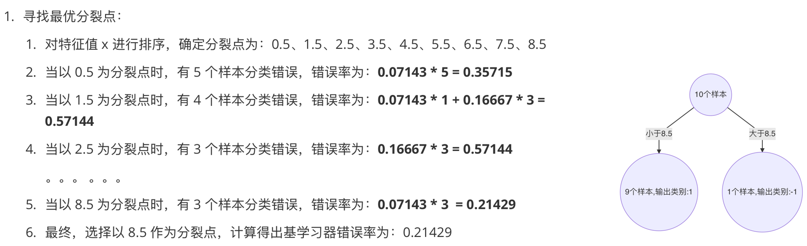 | 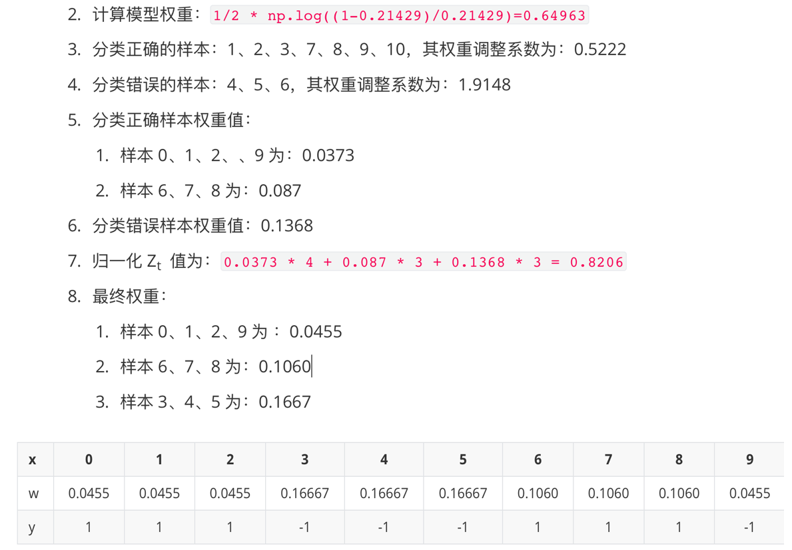 |

### 代码示例

```python
import pandas as pd
from sklearn.tree import DecisionTreeClassifier
from sklearn.ensemble import AdaBoostClassifier  # AdaBoost
from sklearn.metrics import accuracy_score
from sklearn.model_selection import train_test_split
from sklearn.preprocessing import LabelEncoder  # 标签编码器

data = pd.read_csv("./data/wine0501.csv")
# data['Class label'].unique()
# 我们使用二叉树，就需要使用标签编码器，可以直接把 1 类别去掉
data = data[data['Class label'] != 1]
x = data[['Alcohol', 'Hue']]  # 酒精与色调
y = data['Class label']       # 标签列
# 把标签列转为数值列，把 [2, 3] -> [0, 1]
le = LabelEncoder()
y = le.fit_transform(y)

# stratify 表示分割尽量参考 y
x_train, x_test, y_train, y_test = train_test_split(
    x, y, test_size=0.2, random_state=23, stratify=y
)

# Adaboost 指定弱分类器对象，弱分类器个数，学习率
estimator = AdaBoostClassifier(
    estimator=DecisionTreeClassifier(max_depth=3),
    n_estimators=200,
    learning_rate=0.1,
)
estimator.fit(x_train, y_train)
y_pre = estimator.predict(x_test)
accuracy_score(y_test, y_pre)
```

## GBDT（梯度/残差提升树，Gradient Boosting Decision Tree）

通过拟合残差来提升（- 梯度 = 残差 = 真实值 - 预测值）。

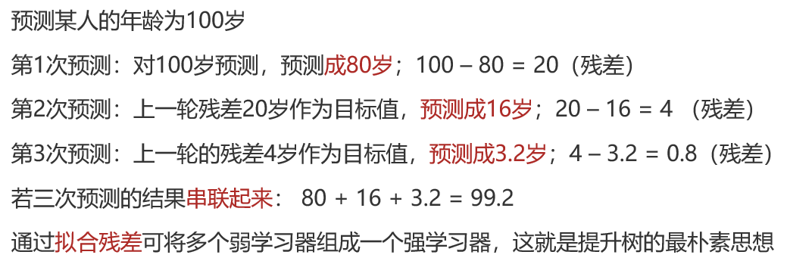

以梯度提升树为例，假设：

- 前一轮得到的强学习器是 $f_{i-1}(x)$
- 损失函数为平方损失是 $L(y, f_{i-1}(x))$
- 本次迭代的目标是找到一个弱学习器 $h_i(x)$，让本轮的损失最小化：

$$L(y, f_i(x)) = L(y, f_{i-1}(x) + h_i(x)) = (y - f_{t-1}(x) - h_t(x))^2$$

那么要拟合的负梯度为：

$$-\left[ \frac{\partial L(y, f(x_i))}{\partial f(x_i)} \right] = y_i - f(x_i)$$

GBDT 拟合的负梯度就是残差。如果进行的是分类问题，则损失函数变为 logloss，此时拟合的目标值是该损失函数的负梯度值。

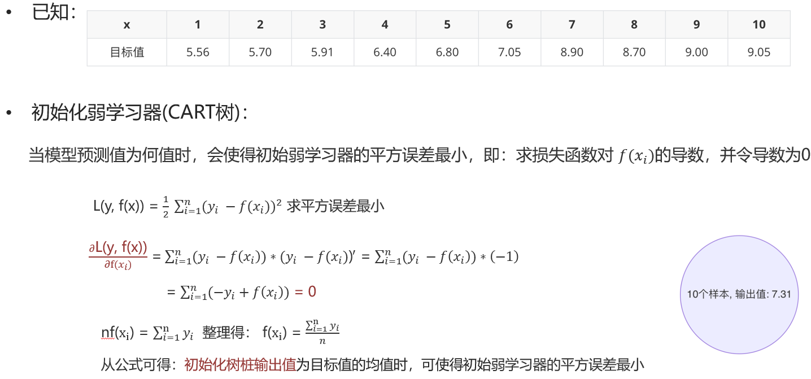 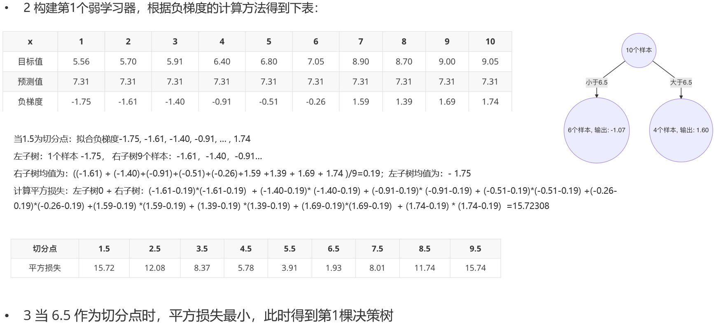 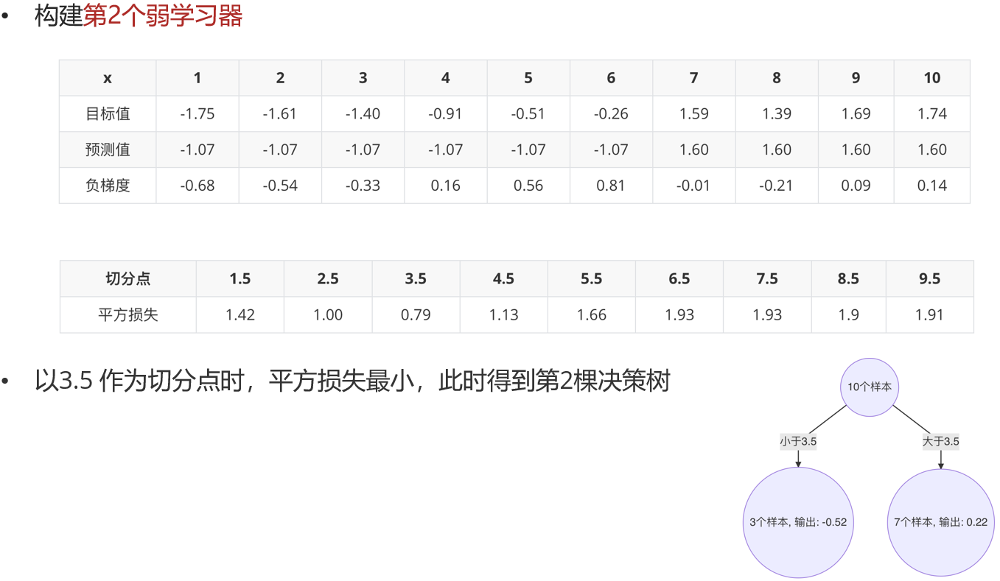 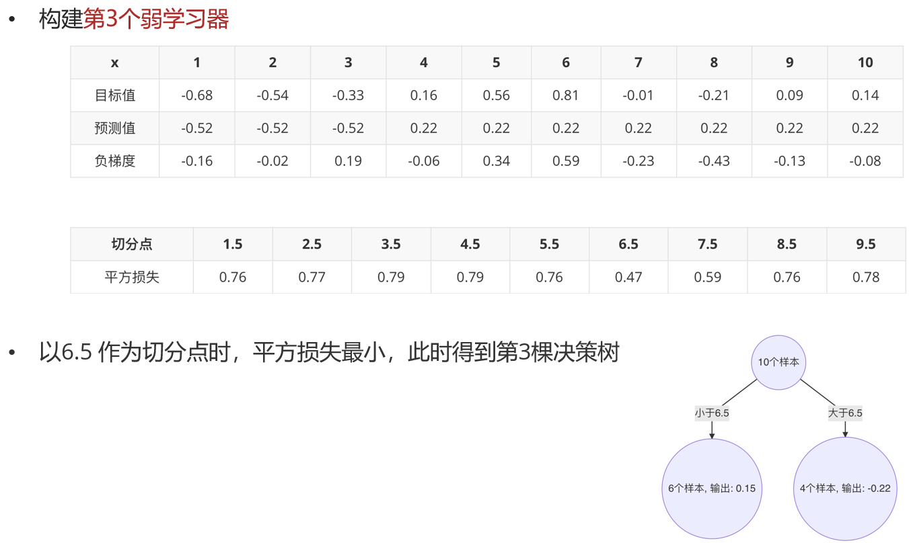 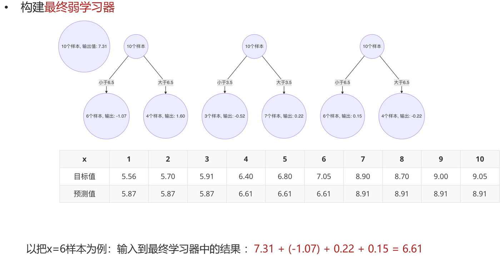

### 代码示例

```python
import pandas as pd
from sklearn.ensemble import GradientBoostingClassifier
from sklearn.model_selection import train_test_split, GridSearchCV
from sklearn.metrics import accuracy_score

data = pd.read_csv('./data/train.csv')
x = data[['Pclass', 'Sex', 'Age']].copy()
y = data['Survived'].copy()
x['Age'] = x['Age'].fillna(x['Age'].mean())
x = pd.get_dummies(x)

x_train, x_test, y_train, y_test = train_test_split(x, y, test_size=0.2, random_state=23)

# 单个 GBDT 树
estimator = GradientBoostingClassifier(n_estimators=50)
estimator.fit(x_train, y_train)
y_pre = estimator.predict(x_test)
print('单个 GBDT 树准确率: ', accuracy_score(y_test, y_pre))  # 0.7932960893854749

# 超参网格搜索
param_dict = {
    'n_estimators': [50, 100, 200],
    'learning_rate': [0.01, 0.05, 0.2, 0.5],
}
# 有些模型做网格搜索时要先训练，是个例需要记住
estimator = GridSearchCV(
    estimator=GradientBoostingClassifier(),
    param_grid=param_dict,
    cv=5,
)
estimator.fit(x_train, y_train)
y_pre = estimator.best_estimator_.predict(x_test)
print('网格搜索后的准确率: ', accuracy_score(y_test, y_pre))  # 0.8156424581005587
```

## XGBoost（极端梯度提升树，Extreme Gradient Boosting）

### 构建思想

最小化训练数据的损失函数，但训练的模型复杂度较高易过拟合。

$$\min_{f \in F} \frac{1}{N} \sum_{i=1}^{N} L(y_i, f(x_i))$$

然后在损失函数中添加正则化项，提高对未知数据的泛化性能：

$$\min \frac{1}{N} \sum_{i=1}^{N} L(y_i, f(x_i)) + \Omega(f)$$

XGBoost 是对 GBDT 的改进，在损失函数中添加了正则化项：

$$\text{obj}(\theta) = \sum_{i}^{n} L(y_i, \hat{y}_i) + \sum_{k=1}^{K} \Omega(f_k)$$

正则化项用来降低模型复杂度：

$$\Omega(f) = \gamma T + \frac{1}{2} \lambda \| w \|^2$$

- $\gamma T$ 的 $T$ 表示一棵树的叶子节点数量
- $\lambda \| w \|^2$ 中的 $w$ 表示叶子结点输出值组成的向量，$\| w \|$ 为向量的模，$\lambda$ 为对该项的调节系数

### XGBoost 打分函数推导

1. 损失函数基础上 + 正则化项
2. 泰勒二阶展开转成近似函数
3. 把问题从样本角度 -> 叶节点角度进行分析
4. 打分函数 -> Gain 值 = 拆分前的分 - (拆分后左子树的分 + 拆分后右子树的分)

要计算第 t 轮的结果（预测值），则第 t-1 轮是已知的，于是：

$$(\text{obj})^t = \sum_{i=1}^{n} L(y_i, \hat{y}_i^{(t)}) + \sum_{k=1}^{t} \Omega(f_k) = \sum_{i=1}^{n} L(y_i, \hat{y}_i^{(t-1)} + f_t(x_i)) + \sum_{k=1}^{t-1} \Omega(f_k) + \Omega(f_t)$$

泰勒展开式是：

$$f(x + \Delta x) = f(x) + f'(x) \Delta x + \frac{1}{2} f''(x) \Delta x^2 + \ldots + \frac{1}{n!} f^{(n)}(x) \Delta x^n$$

上式可二阶泰勒展开为：

$$(\text{obj})^{(t)} \approx \sum_{i=1}^{m} \left[ L(y_i, \hat{y}_i^{(t-1)}) + g_i f_t(x_i) + \frac{1}{2} h_i f_t^2(x_i) \right] + \sum_{k=1}^{t-1} \Omega(f_k) + \Omega(f_t)$$

其中 $g_i$ 和 $h_i$ 分别为损失函数的一阶导和二阶导：

$$g_i = \partial_{\hat{y}^{t-1}} L(y_i, \hat{y}_i^{(t-1)})$$

$$h_i = \partial_{\hat{y}^{t-1}}^2 L(y_i, \hat{y}_i^{(t-1)})$$

注意到可以去掉一些常数，得到：

$$(\text{obj})^{(t)} \approx \sum_{i=1}^{m} \left[ g_i f_t(x_i) + \frac{1}{2} h_i f_t^2(x_i) \right] + \gamma T + \frac{1}{2} \lambda \| w \|^2$$

样本预测值可表示为（T 为叶节点数量）：

$$\sum_{i=1}^{m} g_i f_t(x_i) = \sum_{j=1}^{T} \left( \sum_{i \in I_j} g_i \right) w^2$$

转换到叶子结点的问题：

$$\sum_{i=1}^{m} \frac{1}{2} h_i f_t^2(x_i) = \frac{1}{2} \sum_{j=1}^{T} \left( \sum_{i \in I_j} h_i \right) w_j^2$$

$$\frac{1}{2} \lambda \| w \|^2 = \frac{1}{2} \lambda \sum_{i=1}^{T} w_i^2$$

最终：

$$(\text{obj})^{(t)} \approx \sum_{i=1}^{T} \left[ G_i w_t + \frac{1}{2} (H_i + \lambda) \right] w_i^2 + \gamma T$$

其中 $G_i$ 表示所有样本的一阶导和，$H_i$ 表示所有样本的二阶导和：

$$G_i = \sum_{i \in I_j} g_i$$

$$H_i = \sum_{i \in I_j} h_i$$

令：

$$\frac{d (\text{obj})^{(t)}}{d w_i} = \sum_{i=1}^{T} (G_i + (H_i + \lambda)) w_i = 0$$

得到：

$$w_i = -\frac{G_i}{H_i + \lambda}$$

带入上式得：

$$(\text{obj})^{(t)} \approx -\frac{1}{2} \sum_{i=1}^{T} \frac{G_i^2}{H_i + \lambda} + \gamma T$$

该公式称为打分函数，从损失函数与树的复杂度两方面衡量，构建树时可以来选择树的划分点：

$$\text{Gain} = (\text{Obj})_{L+R} - ((\text{Obj})_L + (\text{Obj})_R) = \frac{1}{2} \left[ \frac{G_L^2}{H_L + \lambda} + \frac{G_R^2}{H_R + \lambda} - \frac{(G_L + G_R)^2}{H_L + H_R + \lambda} \right] - \gamma$$

然后根据 Gain 值对树中的每个叶子结点尝试进行分裂。计算分裂前 - 分裂后的分数：

- 如果 gain > 0，则分裂之后树的损失更小，会考虑此次分裂
- 如果 gain < 0，说明分裂后的分数比分裂前的分数大，此时不建议分裂

**当触发以下条件时停止分裂**：

- 达到最大深度
- 叶子结点数量低于某个阈值
- 所有的结点在分裂不能降低损失
- 等等

### 代码示例

sklearn 中没有，安装 xgboost 包即可，编码风格支持 sklearn 或非 sklearn。

```python
import joblib
import numpy as py
import pandas as pd
import xgboost as xgb
from collections import Counter
from sklearn.model_selection import train_test_split, GridSearchCV
from sklearn.model_selection import StratifiedKFold  # 分层采样对象
from sklearn.utils import class_weight

# 数据处理
data = pd.read_csv('./data/红酒品质分类.csv')
x = data.iloc[:, :-1]
y = data.iloc[:, -1] - 3  # 最后一列是标签，把范围 [3, 8] -> [0, 5]

(x_train, x_test, y_train, y_test) = train_test_split(
    x, y, test_size=0.2, random_state=23, stratify=y
)
pd.concat([x_train, y_train], axis=1).to_csv("./data/train.csv", index=False)
pd.concat([x_test, y_test], axis=1).to_csv("./data/test.csv", index=False)

# 模型训练与保存
train_data = pd.read_csv("./data/train.csv")
test_data = pd.read_csv("./data/test.csv")
x_train = train_data.iloc[:, :-1]
y_train = train_data.iloc[:, -1]
x_test = test_data.iloc[:, :-1]
y_test = test_data.iloc[:, -1]

# 加入平衡权重，因为样本数据集是不均衡的
# 平衡权重，参考的标签
class_weight.compute_sample_weight('balanced', y_train)

# 默认二分类，这里指定下
estimator = xgb.XGBClassifier(
    n_estimators=100, learning_rate=0.1, max_depth=3, objective="multi:softmax"
)
estimator.fit(x_train, y_train)
joblib.dump(estimator, "./model/xgb.pkl")
print(estimator.score(x_test, y_test))  # 0.6375

# 网格搜索 + 交叉验证
train_data = pd.read_csv("./data/train.csv")
test_data = pd.read_csv("./data/test.csv")
x_train = train_data.iloc[:, :-1]
y_train = train_data.iloc[:, -1]
x_test = test_data.iloc[:, :-1]
y_test = test_data.iloc[:, -1]

estimator = joblib.load("./model/xgb.pkl")
param = {
    'max_depth': [2, 3, 5],
    'n_estimators': [100, 200, 500],
    'learning_rate': [0.1, 0.2, 0.5],
}
# 创建分层采样对象，指定折数、是否打乱
skf = StratifiedKFold(n_splits=5, shuffle=True, random_state=23)
# 创建网格搜索 + 交叉验证对象
estimator = GridSearchCV(estimator, param, cv=skf)
estimator.fit(x_train, y_train)
y_pre = estimator.predict(x_test)
print(estimator.best_score_)    # 0.677092524509804
print(estimator.best_params_)   # {'learning_rate': 0.2, 'max_depth': 3, 'n_estimators': 200}
```
